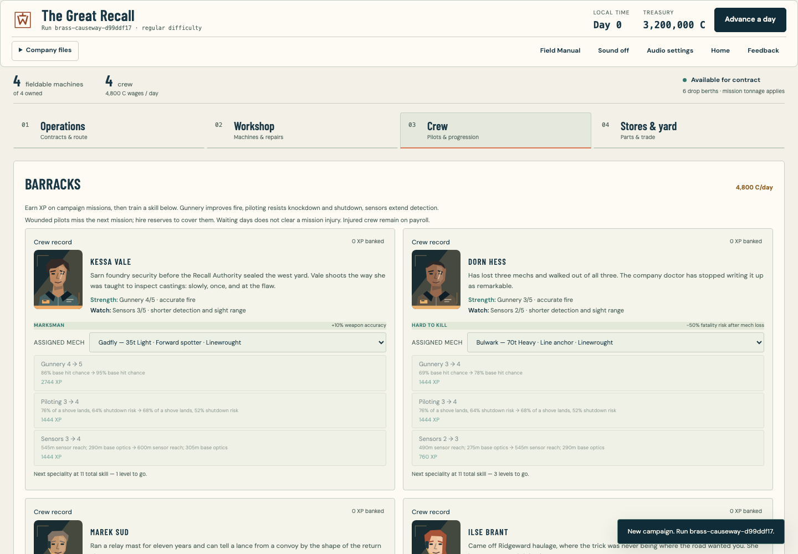
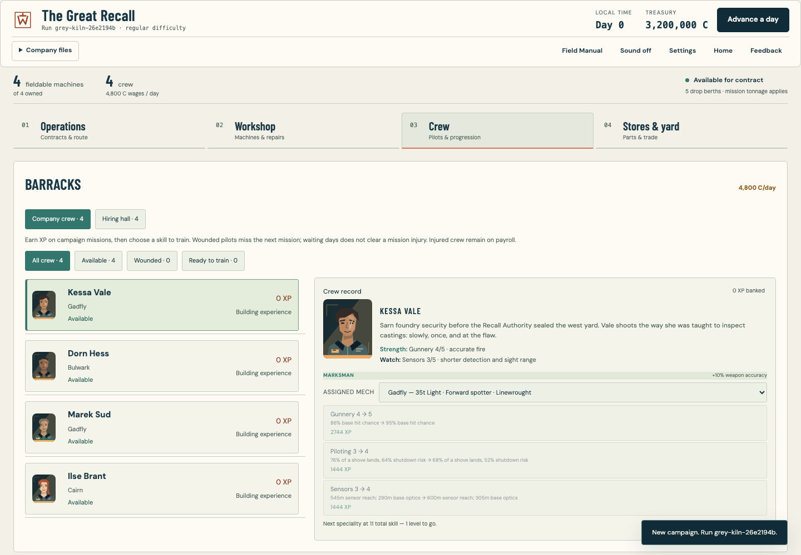
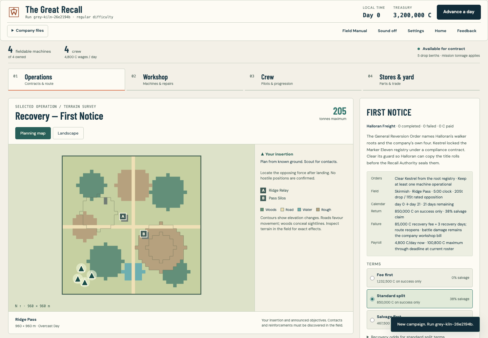
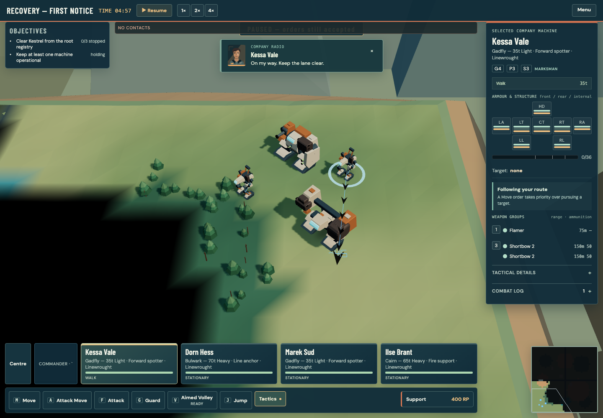
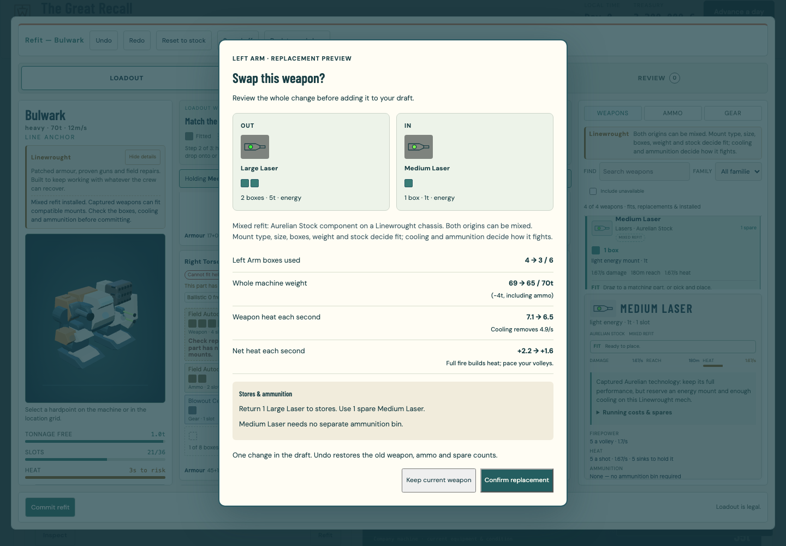
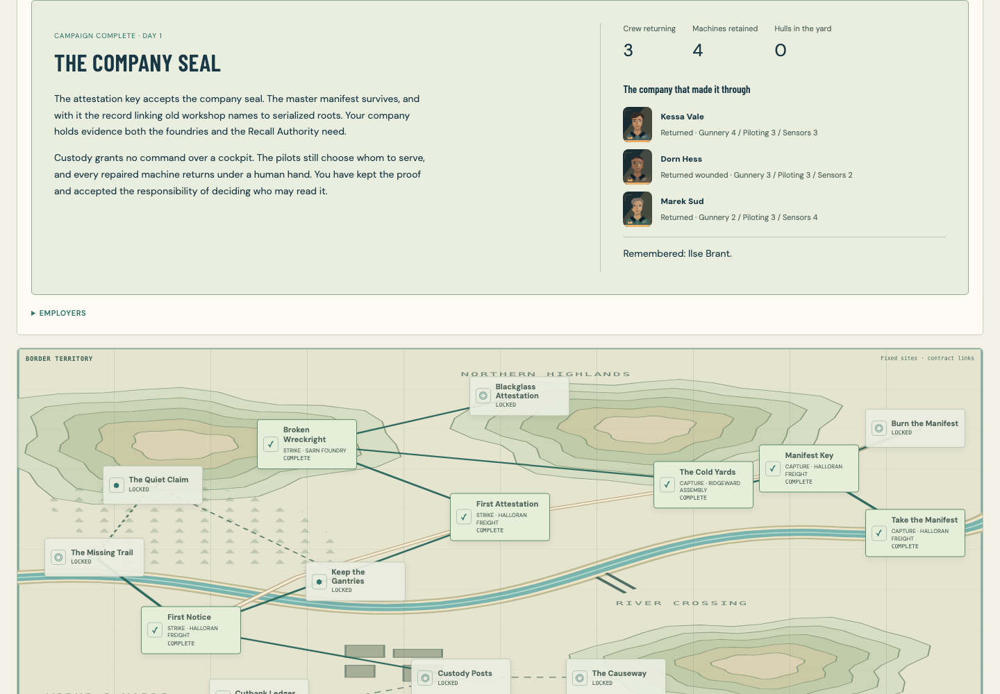

# Command and campaign refinement

This pass keeps Wreckright’s real-time command model and the Ironwork/Monolith visual language. Its focus is making orders, preparation and the consequences of a mission easier to understand.

## Field command

- Guard and Stop cancel queued movement. A new Move remains authoritative.
- Attack approaches a reachable firing position suited to the live, enabled weapon battery. Empty ammunition, weapon groups, optical visibility and standing orders affect the plan.
- Selected machines show their intended route and explain whether they are approaching, guarding, cooling or unable to fire. Sensor returns never reveal hidden unit details through this display.
- Enemy deployments can defend, retake or intercept around authored objectives rather than all pursuing the same target.
- Brief pilot captions and faction-specific radio keying tones acknowledge orders. Friendly damage takes priority, repeated reports are limited, and public mission transmissions can have an authored speaker. These are captions and synthesized cues, not recorded voice acting.

## Company preparation

- Most missions allow five machines, subject to tonnage. Explicit Aboard/Reserve choices persist; Autofill is optional. Named lance presets preserve the commander’s chosen seats and still require readiness checks.
- The planning map shows terrain, elevation, known landmarks, friendly insertion and announced objective sites. The Landscape tab retains the oblique terrain view. Neither supplies hidden enemy positions.
- The crew list is compact, with filters and one selected pilot record. Debrief actions lead to the relevant repair, training, crew or stores screen without automatically spending credits.
- Installed weapons with no spare stock are labelled accordingly. Dropping a weapon onto an occupied mount opens a whole-swap preview: boxes, weight, heat, ammunition and inventory. Confirm, cancel and undo operate on the complete replacement.

## Optional campaign branches

| Campaign | Mission | Allowance | Purpose |
| --- | --- | --- | --- |
| The Great Recall | Marker survey | 45t / 1 | Secure survey sites without a kill requirement |
| The Great Recall | Recovery window | 140t / 3 | Hold recovery ground until collection |
| The Great Recall | Workshop defence | 205t / 5 | Protect the workshop and choose whether to retrieve stores |
| Aurelian campaign | Custody survey | 50t / 1 | A limited survey deployment |
| Aurelian campaign | Custody resupply | 135t / 3 | Recover supplies while holding assigned ground |

Existing campaign node IDs and prerequisites remain intact. The branches become available after the first contract; old companies can enter them without restarting.

Authored rewards are shown before signing and listed separately from random battlefield salvage. They require a successful contract and, where stated, a completed optional objective. Claimed rewards survive save/reload and history archiving. A released warehouse hull is a separate physical machine, stripped and damaged, rather than a second award of a destroyed enemy.

Workshop day credits shorten later repair/rebuild bookings. They do not waive parts or labour prices, advance the calendar, or cancel payroll. Supplier discounts apply for the displayed return-period window.

Actual deployed pilots share bounded mission/objective experience. Existing combat awards remain; reserves and forfeits do not receive the new shared bonus. Persistent claim records cap objective XP across retries. The ending report follows the won campaign route and names surviving and fallen crew.

## Presentation and guidance

Named relay, silo, gantry and spire landmarks occupy existing blocked map tiles. Generic buildings and causeway rails are lower, improving the view of machines. Landmark rendering follows battlefield exploration and retains bounded instanced batches. Terrain movement and line-of-sight cells are unchanged.

Linewrought machines show more weight transfer when turning, braking and bracing. Aurelian machines remain more stabilized. Heat colours build gradually; reduced motion avoids the new stance impulses.

Settings combine sound, graphics quality and control help. Relevant field tips cover sensors, formations, support and recovery, with a reset in Settings. Existing save keys and offline packaging are preserved.

## Validation and handoff

### Visual review

The crew view previously repeated full records for every pilot:

The current view keeps the roster visible beside one selected record:

The planning map connects known landmarks and terrain to the drop:

Orders receive a pilot acknowledgement and an explanation beside the selected machine:

Replacement consequences are visible before the draft changes:

The completed route ends with its consequences and the surviving company:

These images were captured and inspected during integration. Phone captures are also retained in the browser evidence folders.

Automated checks cover deterministic combat, private information boundaries, deployment, inventory conservation, reward retry protection, pilot progression, old saves, draw budgets and browser interactions. Visual evidence is captured with a muted headless browser; the user’s desktop is not controlled.

Final validation counts and review evidence are recorded with the delivery commit and pull request. The build remains a review branch until explicitly released.

The separate [playtest pack](PLAYTEST_PACK.md) is for people who have not played before. Automated playthroughs establish correctness; actual uncoached player observations are still required to judge clarity and enjoyment.
