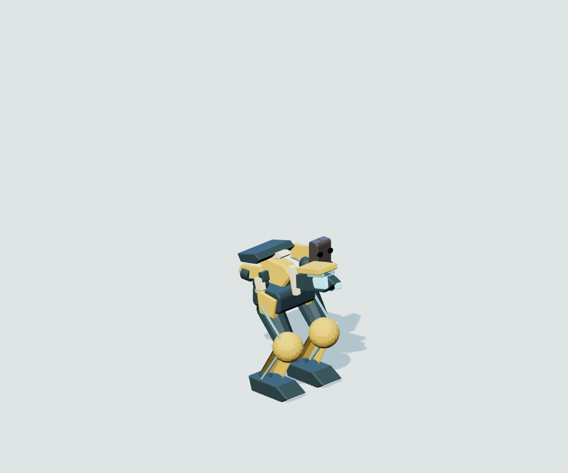
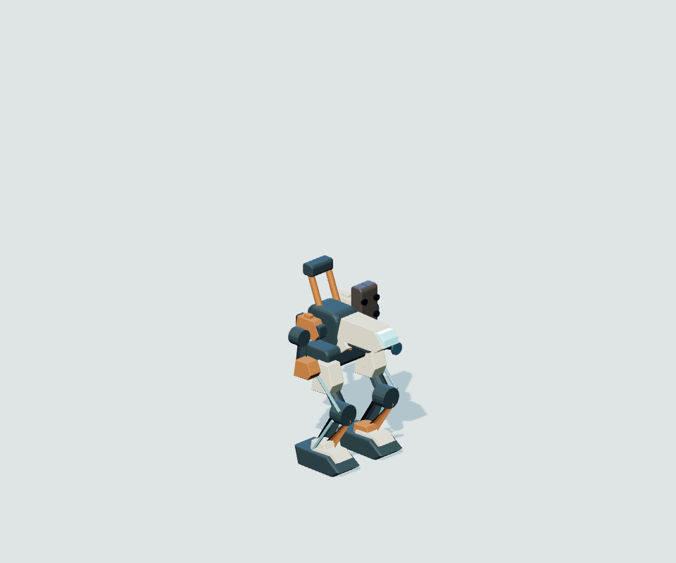
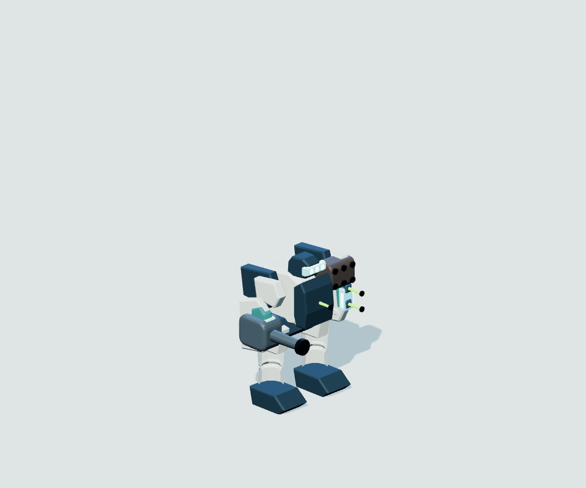
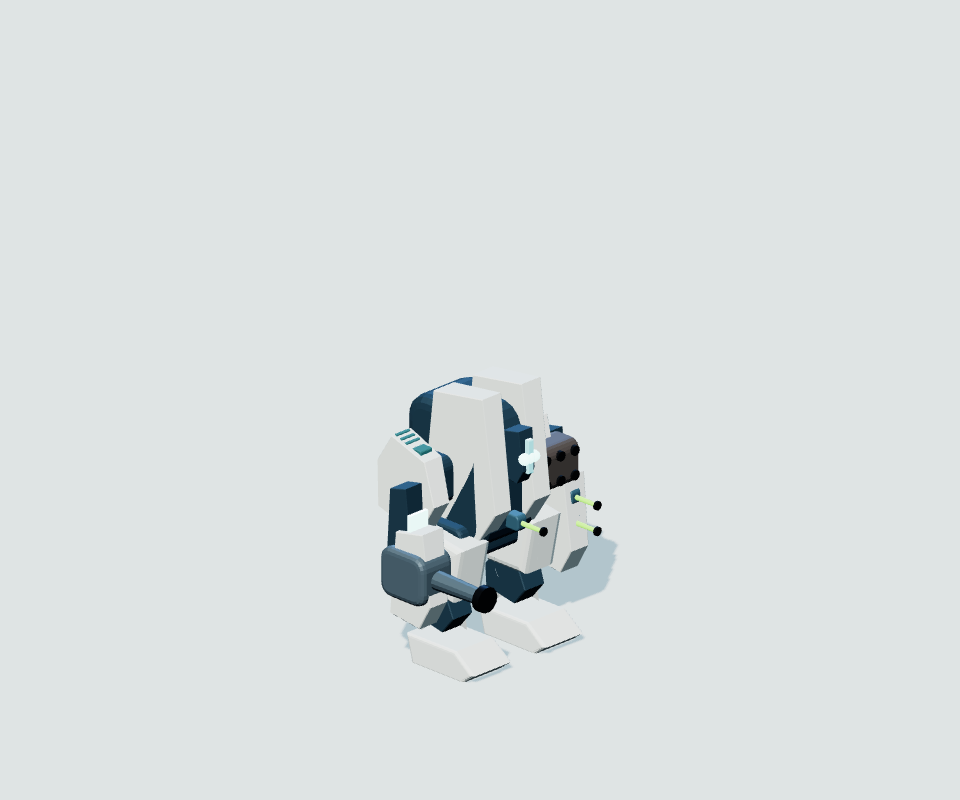
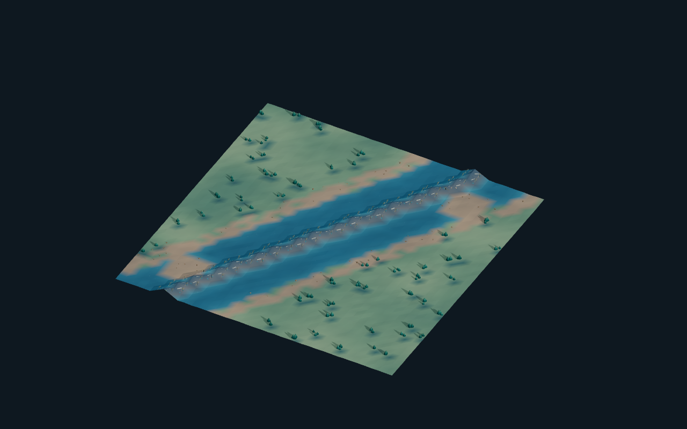
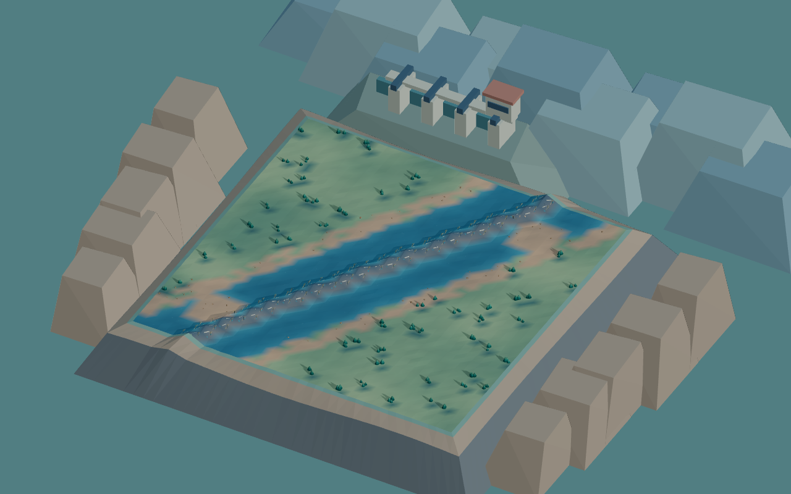
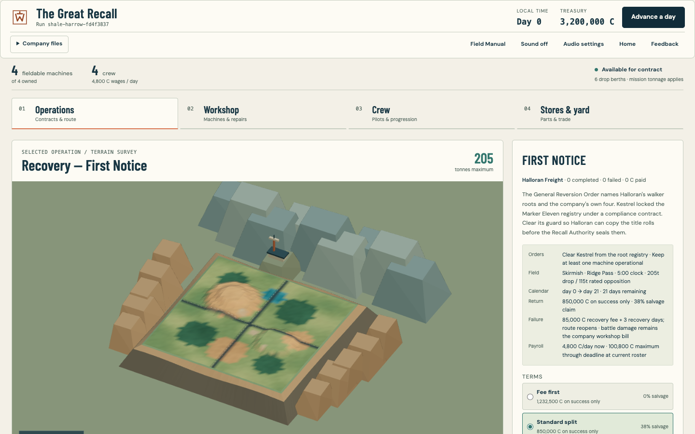
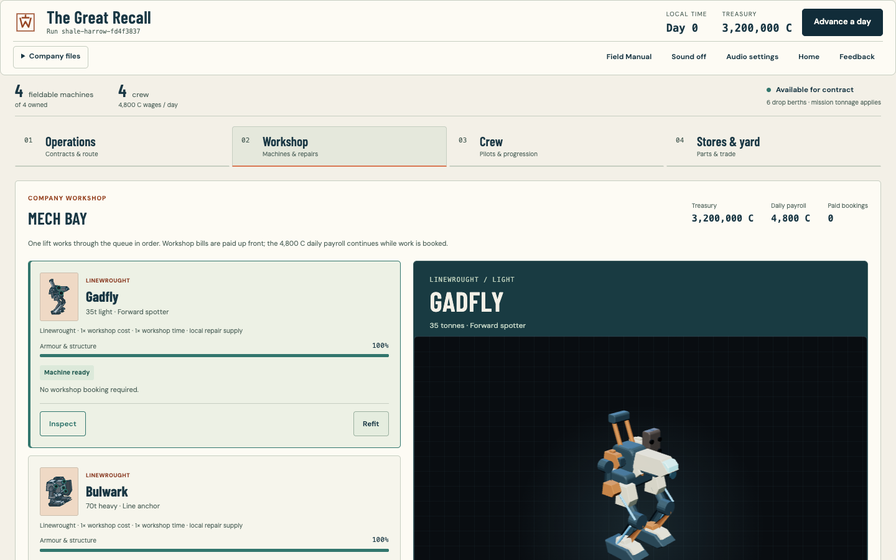
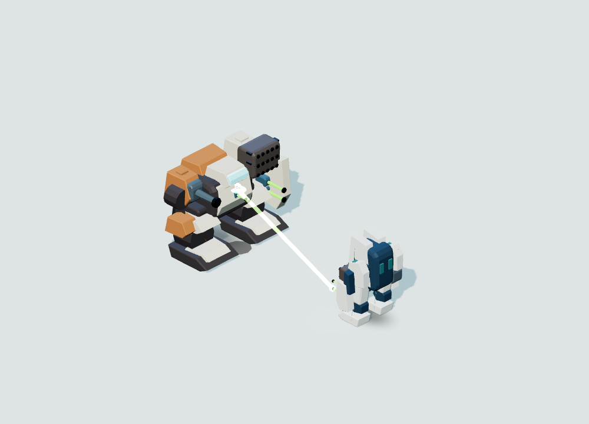
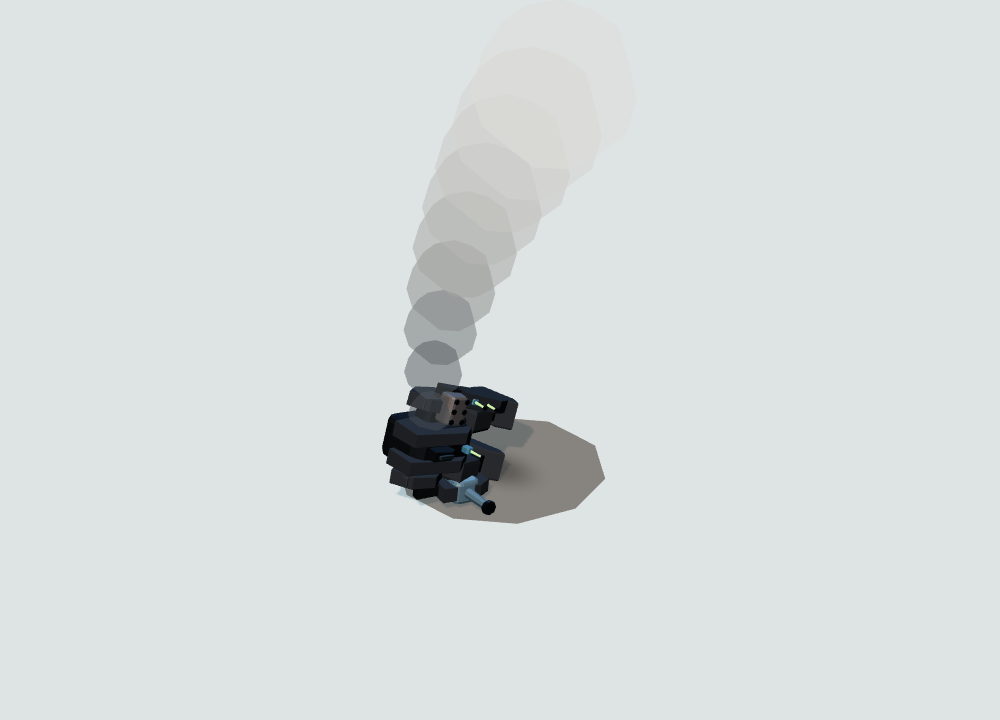

# Ironwork & Monolith

Wreckright keeps its real-time-with-pause combat, component damage, mission tonnage,
fitting, salvage and company economy. This rebuild applies the chosen Ironwork and
Monolith construction language to the actual shared 3D models, then carries the
Graphic Expedition presentation into the campaign, workshop and battlefield.
The comparison baseline is Wreckright `762de23440f6b08f4f9bca15034706d3984a227c`.
This work retains Wreckright's six drop berths and campaign systems; it does not
import The Long Crossing's separate game rules or campaign.

## Machine families

Linewrought machines use cream protective slabs, orange repairs, open dark load
frames and broad mechanical boots. Aurelian Stock uses paired ivory armour masses,
deep navy recesses, closed shoulder supports and teal optics. Construction follows
the chassis; recovering a machine does not change its engineering culture.

Each walker has its own primary silhouette and existing component regions and
weapon hardpoints. The same model builder supplies battle, refit and Workshop
inspection. Low FX keeps the structural silhouette; surface fittings appear at
closer distances. Support vehicles and the fixed emplacement retain their frames.

| Linewrought | Tonnes | Aurelian Stock | Tonnes |
| --- | ---: | --- | ---: |
| Prybar | 25 | Vesper | 25 |
| Gadfly | 35 | Votive | 35 |
| Rivet | 45 | Sentinel | 45 |
| Trestle | 55 | Falchion | 50 |
| Cairn | 65 | Warden | 60 |
| Bulwark | 70 | Halberd | 75 |
| Rampart | 85 | Obsequy | 90 |
| Colossus | 100 | Pallvault | 100 |

That is eight walkers per faction. Courser (30t) and Drover (50t) remain vehicles;
Redoubt (40t) remains a fixed emplacement. They are additional support frames,
not part of either eight-walker count. Legacy IDs such as `hornet_hnt2` (Gadfly)
and `wisp_wsp1` (Vesper) remain valid.

Prybar, Rivet and Trestle are new authored chassis/design pairs. They fill courier,
convoy-guard and field-battery roles through the existing rotating market. Existing
design IDs, statistics, mission deployments and save keys are preserved.

## Campaign and Workshop

- Operations displays the selected mission's terrain, elevation, atmosphere and
  tonnage beside the existing contract terms. A signed contract takes precedence.
  The survey receives a projected data object with no deployment, reserve or
  trigger state; it does not start a battle or reveal contacts.
- The survey renders one off-screen frame, retains a PNG in a three-image cache,
  and immediately disposes its scene and WebGL context.
- Campaign sites stay at their authored coordinates. Separate label positions
  avoid overlap, while two geographical theatre illustrations give routes context.
- Workshop pairs the machine roster with a large inspection stage showing real
  equipment and condition. Existing repair, refit, payroll and queue controls stay
  with their records. Hidden or covered previews release their render loop and
  context. Mobile Inspect reveals the selected machine without moving focus.
- Tactical readiness puts immediate orders, heat and availability ahead of deeper
  inspection. Component details and advanced combat controls remain available.

## Places and motion

The six battlefields gain joined outer ledges, grouped rock formations and distinct
public horizon landmarks: survey stations, foundry structures, quarry terraces and
flood gates. Every new scenery triangle lies outside the playable rectangle.
Movement, cover, elevation sampling and fog-gated props continue to use the existing
terrain. The surroundings cost two additional normal-mode draws; Low FX keeps the
previous single surround draw. Ash Dusk receives brighter fill lighting and a
cleaner terrain tint without changing its weather mechanics or night classification.

Physical sole contacts now drive footfall sound, dust and water rings. Jump exhaust
starts at real rear housings. Gait recovery and recoil transfer weight through the
stance, with restrained Aurelian movement. Visible heat is attached to rear service
surfaces. Directional collapse articulates knees, arms and shoulders and supports
the resulting wreck against the ground.

Ballistics throw directional chips and sparks; energy produces a contact flare;
missiles produce expanding blast lobes and smoke. Contact positions follow the
struck component's exterior rather than its internal centre. Pools retain fixed
capacity, terminal priorities, visibility gating and resource disposal. Low FX and
reduced motion suppress decorative effects while retaining essential hit cues.

## Audio

Known field sounds are placed relative to the camera, with distance attenuation and
bounded stereo spread. Interface cues stay centred. Shared Audio settings control
master, effects, music and interface levels plus normal/quiet dynamic range. Legacy
mute remains compatible. Music and ambience use separate buses; gesture unlock,
event admission, contact privacy and bounded teardown remain enforced.

## Visual comparisons

These are unmodified PNGs from the review fixtures, copied into the repository so
the comparison remains available without the ignored `reports/` directory. The
Gadfly and Sentinel pairs use their loaded authored designs, the same front-quarter
camera, lighting, scale and background. The Causeway pair uses the same map camera.
Click an image for the original capture.

| Subject | Before | Ironwork & Monolith | What to compare |
| --- | --- | --- | --- |
| Gadfly, 35t Linewrought | [](images/ironwork-monolith/gadfly-before.png) | [](images/ironwork-monolith/gadfly-after.png) | Narrow cab, exposed load frame, raised rear fittings and articulated boots. |
| Sentinel, 45t Aurelian Stock | [](images/ironwork-monolith/sentinel-before.png) | [](images/ironwork-monolith/sentinel-after.png) | Paired upright armour masses, recessed core and enclosed shoulder construction around the existing weapons. |
| The Causeway | [](images/ironwork-monolith/causeway-before.png) | [](images/ironwork-monolith/causeway-after.png) | Joined outer ledges, surrounding rock masses and the public flood-gate landmark; the playable map stays in place. |

The current Operations view places the terrain survey next to contract terms:

[](images/ironwork-monolith/operations.png)

Workshop keeps the roster, readiness and paid orders beside the shared 3D inspection
stage. The [full-page Workshop capture](images/ironwork-monolith/workshop-layout.png)
also includes the lower machine cards and installed armament.

[](images/ironwork-monolith/workshop-viewport.png)

The motion fixture uses actual model and effect pools. These milestones show an
energy discharge meeting its exterior contact flare and smoke rooted in a settled,
articulated wreck. They are static samples of the animation, not a video.

| Exterior energy contact | Settled wreck and smoke |
| --- | --- |
| [](images/ironwork-monolith/energy-contact.png) | [](images/ironwork-monolith/settled-wreck.png) |

The [capture manifest](images/ironwork-monolith/capture-manifest.json) records source
paths, exact file sizes, SHA-256 hashes and the shared model-camera settings. Static
model comparisons do not establish animation, audio, battle balance or release
readiness.

## Review and verification

These review captures use disposable headless contexts, with one browser run at a
time. They do not use a person's browser profile or foreground input. The full
playthrough, landscape and campaign UI runners mute device output. Static model
and motion fixtures do not start audio; audio graph tests inspect signal routing.

With a Vite server running, the following review fixtures produce PNGs and JSON
diagnostics under ignored `reports/` directories. Set `BASE_URL`, `SHOT_DIR`, and
optionally `CHROMIUM_PATH` for the local environment.

```sh
node tests/e2e/mech-design-review.mjs
node tests/e2e/landscape-review.mjs
node tests/e2e/combat-motion-review.mjs
node tests/e2e/ironwork-ui-review.mjs
```

The model fixture covers all sixteen walkers in 78 captures: real loadouts,
tactical/elevated/Low FX views, monochrome silhouettes and representative equipment
and damage variants. The six-map fixture uses a fixed camera and supports
`BASELINE=1` against the preceding checkout. The motion fixture captures 65 actual
gait, discharge, impact, thermal, damage and wreck milestones. The 14 UI checks
cover exact save preservation, focus, actual context disposal and loss, mobile
geometry, signed surveys and inspection.

Required release gates remain typecheck, lint, the complete fast suite, the full
browser playthrough, deterministic balance and campaign acceptance, and both build
formats. The single-file build also has an offline browser smoke test. Review
captures are visual evidence; they are not substitutes for these gates or for
playing the build. The default branch remains the production deployment boundary.

Record automated gate results on the pull request for the candidate commit. The
checked-in captures remain available as visual evidence alongside that review.
