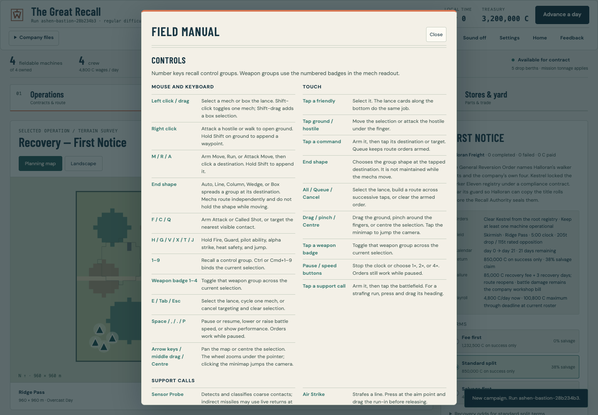
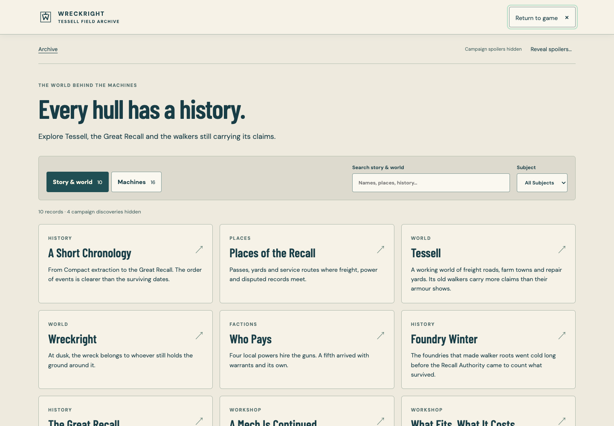
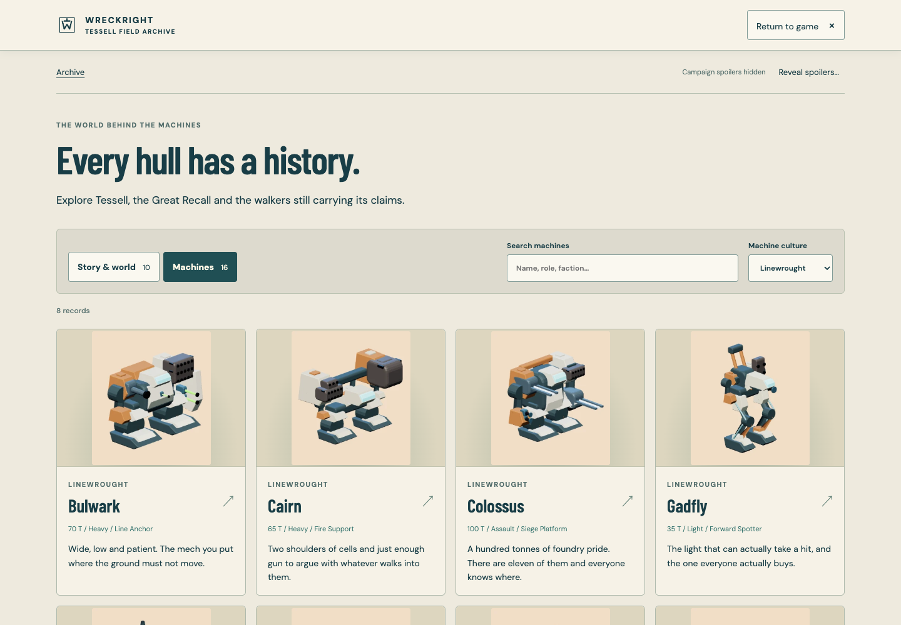
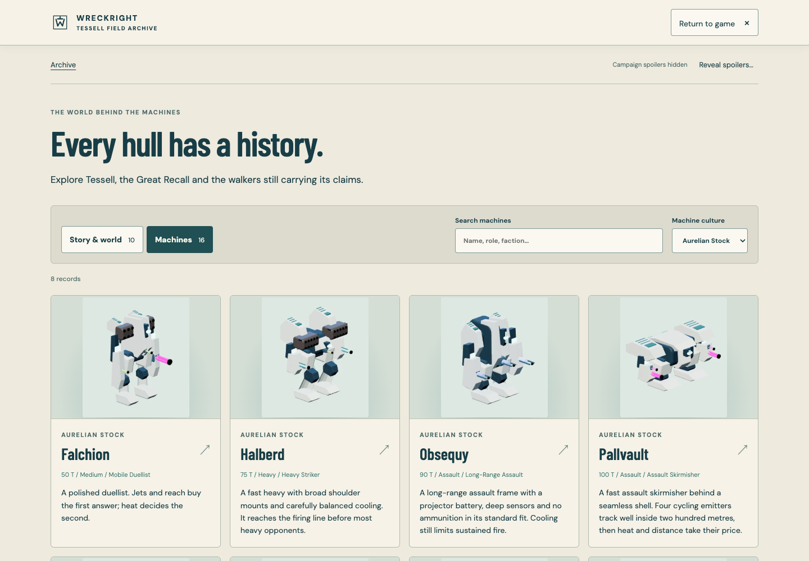
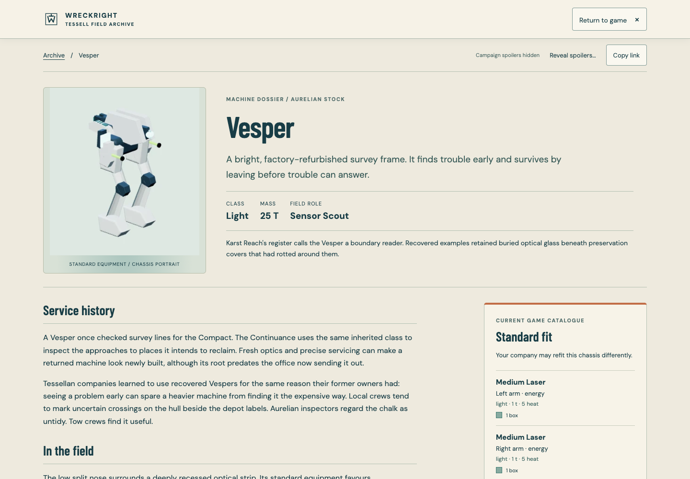
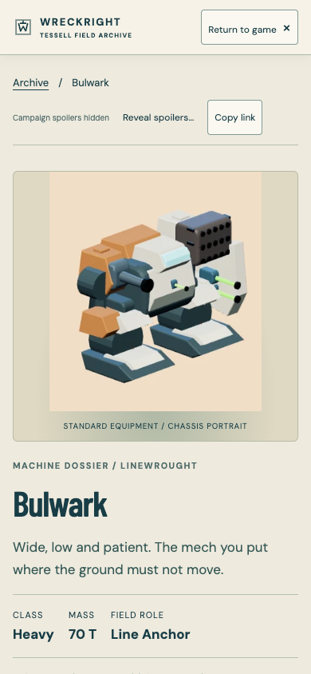
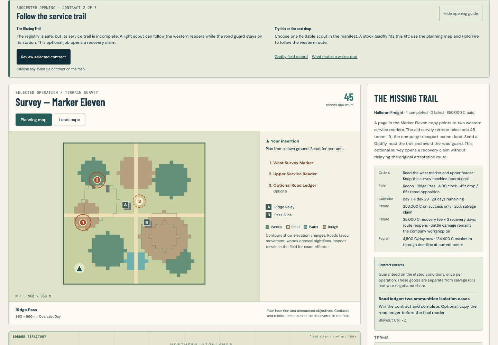

# Tessell field archive

The archive gives Wreckright a browsable setting and a record for every walker.
It also connects the opening contracts to the people, machines and claims behind
them. The command model, campaign rewards and fitting rules remain unchanged.

## Reading the archive

Open **Story & machines** from the home screen or company screen, or follow a
machine's history link from its dossier. Search story records by words in their
text and filter by subject. Search machines by name, culture, role or service
history and filter between Linewrought and Aurelian Stock.

The archive contains **14 story articles**: the 11 existing canonical lore
records, plus **Tessell**, **Places of the Recall** and **A Short Chronology**.
It also contains **16 machine dossiers**, eight for each culture. Each dossier
combines a portrait, provenance, service history and field notes with the current
catalogue's specifications, strengths, weaknesses and standard fitting.

All machine dossiers are public. Campaign discoveries stay hidden until the
current company earns them, or already knows them through its campaign. The
public archive starts with ten story records and four hidden discoveries.
Search, connected records and direct article links respect those boundaries;
an undiscovered page does not expose its title or summary. **Reveal spoilers…**
requires confirmation and applies only to the current archive visit. It does
not complete missions or unlock anything in the company save.

Native address fragments make pages shareable:

```text
#wiki
#wiki/story/tessell
#wiki/story/the_line
#wiki/mech/hornet_hnt2
#wiki/mech/wisp_wsp1
```

The last two addresses display Gadfly and Vesper. Their older internal IDs remain
stable for links and saved game data. **Copy link** copies the current address;
when clipboard access is unavailable, an address field allows manual copying.
Invalid archive links show a missing-record page.

Opening a direct archive link does not create a company, start training or mount
a battlefield. Opening it from an existing game keeps that game mounted and
pauses any battle. Returning preserves the current screen, unsaved refit draft
and prior pause state. Discovery reads the stored company without writing,
recovering or replacing its save; an unreadable save falls back to public lore.

## Suggested opening routes

The company screen explains a short optional route through each campaign:

| Company | First contract | Single-scout survey | Smaller recovery detail |
| --- | --- | --- | --- |
| Linewrought | First Notice | The Missing Trail | The Quiet Claim |
| Aurelian Stock | First Warrant | The Unbroken Chain | Under Civil Seal |

Each suggestion explains the contract's purpose, something useful to practise,
and related archive records. Its **Review** button selects the existing posting.
It never signs a contract, changes the deployment or spends company resources.

Progress follows completed campaign nodes. A defeat does not advance the guide.
Other available contracts remain available, an accepted contract takes priority,
and established companies that followed another route are not sent back to the
beginning. The suggestions require no new save fields.

## Authoring and canon

Story metadata lives in `src/data/wiki/story`; machine histories live in
`src/data/wiki/mechs`. The file name must match its `id`.
`src/schema/wiki.ts` validates both formats and `src/wiki/library.ts` resolves
them against the live catalogue. Related records use `{ kind, id }` references;
missing destinations, duplicate links and self-links are rejected.

For an existing story, use a wrapper with `sourceLoreId`, `category` and
`related`. Omit `title`, `summary` and `sections`: those come from the canonical
record in `src/data/lore`, together with its discovery conditions. Change prose
at its canonical source so the manual and archive cannot drift apart.

A new story instead supplies `title`, `summary` and `sections`, each containing
a heading and paragraph array. Keep summaries under 240 characters and each
paragraph under 1,200. The available subjects are `world`, `history`, `factions`,
`places` and `workshop`. New public prose must not reveal discoveries merely by
describing a linked locked page.

A machine record uses the chassis ID, a matching stock `designId`, `provenance`,
two to four `serviceHistory` paragraphs, `fieldNotes` and related records.
Write history and character here. Technical specifications, armament and
strengths/weaknesses come from the chassis, design and equipment catalogue.
The displayed stock fit is a reference; a company's actual refit can differ.
Support vehicles and emplacements are not part of the sixteen-walker directory.

Follow the current direction in `FACTION_PLAN.md` and read all existing lore
before extending it. Linewrought and Aurelian Stock are machine cultures, not
two complete armies. Neither side manufactures new roots. Service readers
attest identity but cannot command or locate an active walker. Borrowed serial
records do not multiply physical roots. Local yards perform paid repairs;
Aurelian replacement equipment comes from recovery, another owned machine or
a specific campaign supply transfer. Avoid blanket claims that every Aurelian
machine is sealed or impossible to service.

Opening-route copy lives in `src/data/opening_routes.json`, validated by
`src/schema/openingRoute.ts`. Keep its node IDs and contextual links aligned
with existing campaign data. The helper derives suggestions; it does not add a
second campaign progression system.

## Offline and review

`npm run build:single` embeds the archive, portraits and game in
`dist-single/wreckright.html`. Article fragments work in that file, including
direct reloads. A local file address is useful on the same computer; share the
hosted address when sending an article to someone else.

Run focused data and behaviour checks:

```sh
npx vitest run src/wiki src/schema/openingRoute.test.ts src/ui/campaign/openingRoute.test.ts
npm run typecheck
npm run lint
```

With a development server running, review the archive and opening suggestions in
one muted headless browser:

```sh
BASE_URL=http://127.0.0.1:5218/ OPENING_ROUTES=1 SHOT_DIR=reports/lore-wiki/after node tests/e2e/lore-wiki-review.mjs
```

The full browser playthrough includes archive coverage. The standalone smoke
check exercises the built offline archive as part of the game journey:

```sh
npx vitest run --exclude '**/balance.test.ts' --exclude '**/e2e/**'
node tests/e2e/playthrough.mjs
npm run build
npm run build:single
node tests/e2e/standalone-smoke.mjs
```

Inspect screenshots as well as assertions. Use one background browser at a time
and keep the user's desktop available. Final gate results and counts belong in
the delivery record and pull request.

Automated checks cover catalogue accuracy, discovery boundaries, routing,
keyboard and phone navigation, preserved refit drafts and offline loading.
They do not establish that first-time players find the story engaging or the
opening intuitive. Use the [playtest pack](PLAYTEST_PACK.md) for uncoached human
sessions; no participant results are implied by this implementation.

## Visual reference

The earlier manual presented setting material as a reading section:



The archive gives story records their own searchable front door:



Both machine cultures have complete illustrated collections:





Desktop and phone dossiers pair history with the current standard fit:





The opening route connects the next contract with its purpose and relevant lore:


