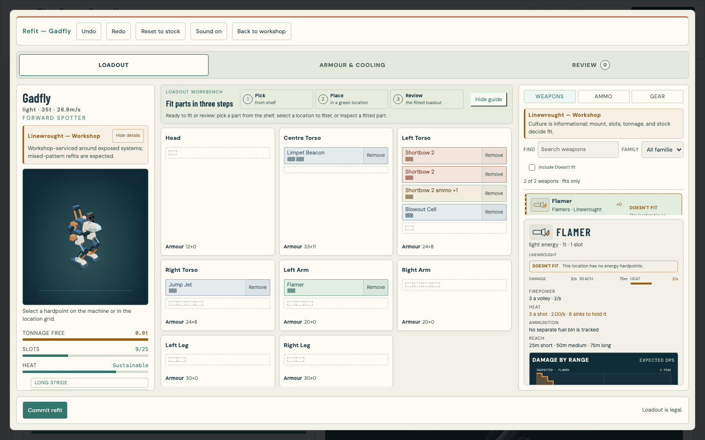
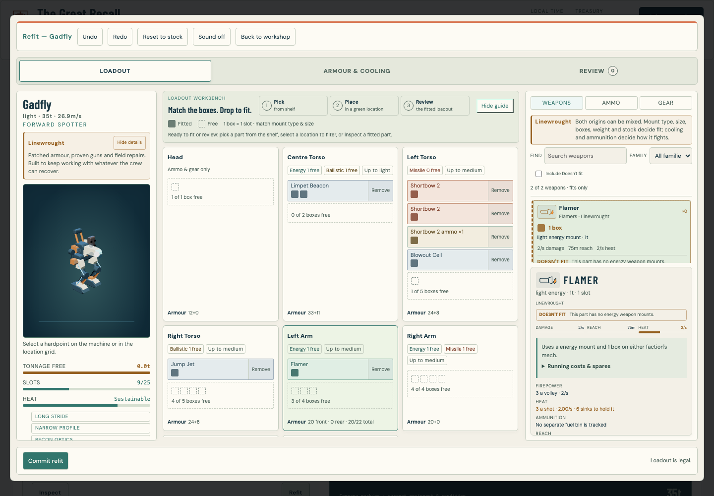
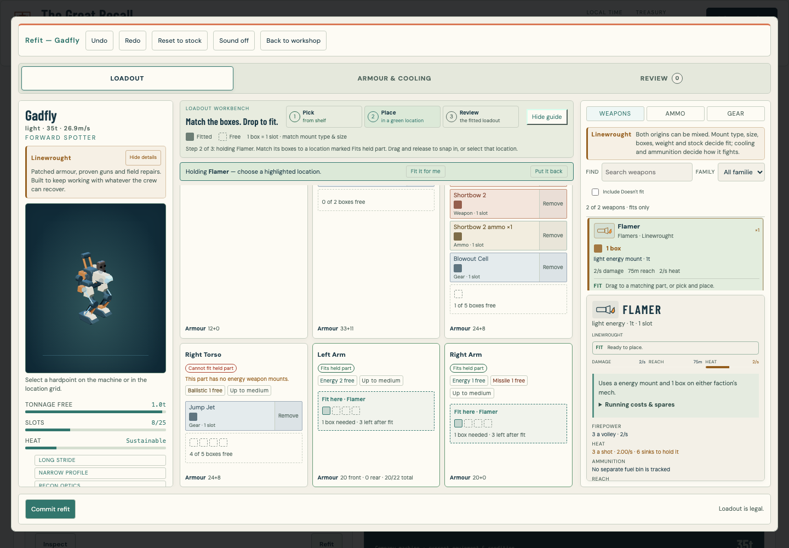
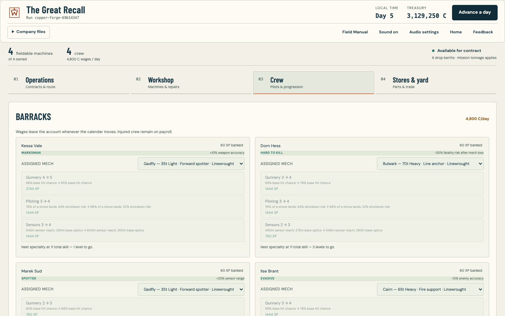
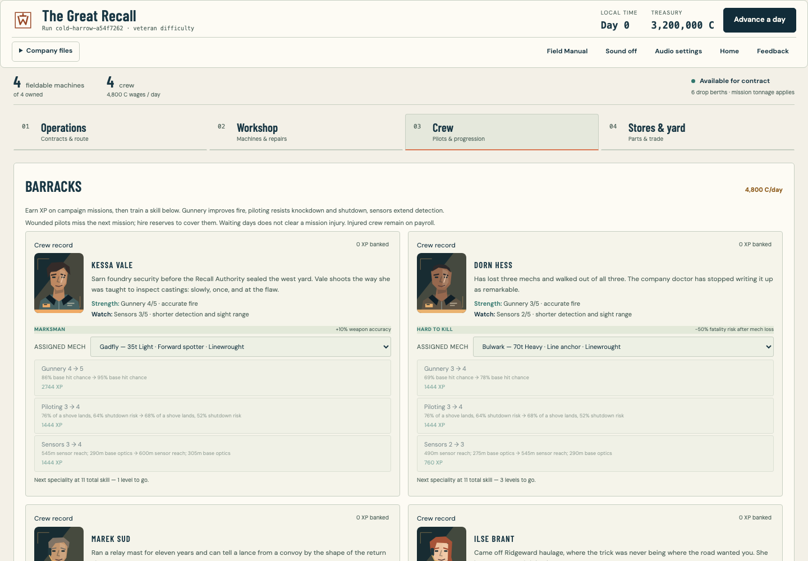
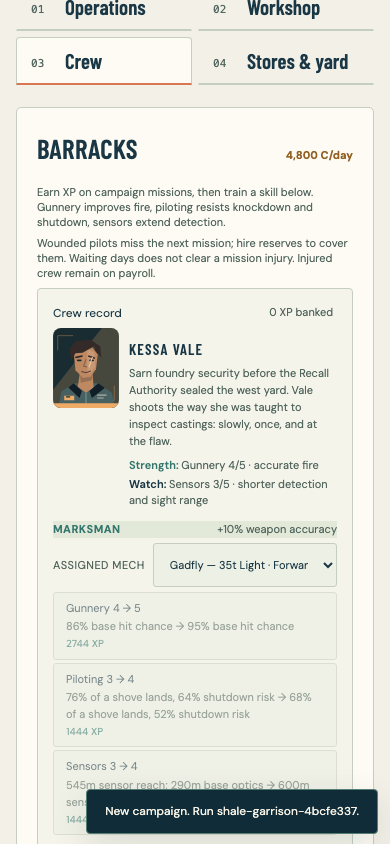
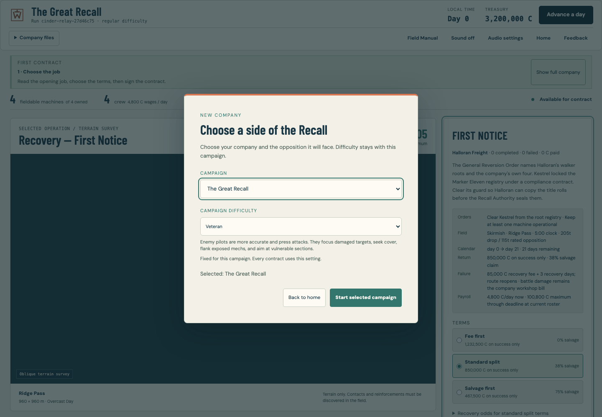
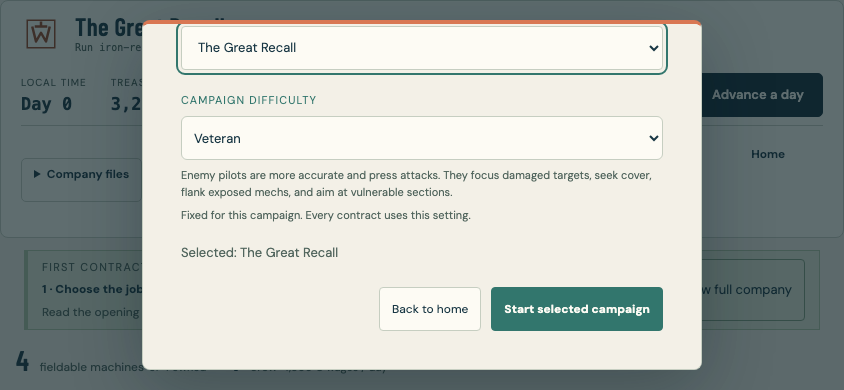

# Mech bay and company crew

Weapons and machine parts now show matching fitting boxes. One box is one
internal slot; a weapon still needs the correct mount type and rating, enough
payload and an available copy. Compatible destinations display the incoming
footprint and weapon name. Native drag and drop snaps the weapon into the
section. Picking a card and selecting a section uses the same validation for
keyboard and touch players. Undo and the existing reviewed refit transaction
remain available; a draft cannot silently spend the company's stock or money.

## Bay comparison

Before, the weapon shelf omitted the visual footprint and resting locations
hid mount constraints. The new view exposes both. Armour and cooling remain in
their own workbench; overweight drafts carry a warning and cannot be committed.

## Machine cultures

Linewrought crews rebuild their machines around proven workshop weapons and
whatever they recover. Aurelian crews return with factory-refurbished shells,
advanced optics and compact energy weapons, and often mistake clean paint for
proof of superior pilots. The original roots remain finite; newly serviced
systems explain the difference in apparent age without creating a factory for
replacement walkers.

Either side can fit captured weapons to suitable mounts. Aurelian technology
keeps its performance on Linewrought machines but requires energy mounts,
cooling and salvaged replacements. Workshop guns on Aurelian machines require
the appropriate mounts, ammunition space and payload. There is no hidden adapter
penalty. The bay explains actual operating and supply costs using the catalogue.
See [faction fitting](FACTION_FITTING.md) for measured weapon comparisons,
standard mixed refits, salvage and workshop economics. Combat statistics and
existing equipment IDs are unchanged.

Every chassis has an actual model portrait and a short field guide with strengths
and weaknesses. These are chassis tendencies, with a visible reminder that the
player's loadout controls the final build. The live preview still shows the
actual fitted weapons and damage. Aurelian labels no longer call every machine
“sealed”.

## Crew and campaign rules

Each of the twenty-four pilots has an authored portrait, existing character bio,
and strengths/weaknesses derived from current skills. Gunnery, piloting and sensors
training describes the actual combat effects. The debrief surfaces mission XP;
the barracks spends it on the commander's chosen skill and earned specialities.
No passive experience is granted for workshop time.

New injuries require missing one subsequent resolved campaign mission. The
counter persists across saves; travel and ordinary contract abandonment do not
clear it. Replacements can use an injured pilot's machine. KIA leave the active
roster permanently and appear in a roll of honour; assignment or hiring cannot
resurrect them.

If every living pilot is injured and no relief pilot is affordable, the company
can explicitly forfeit a signed contract and recover. The action displays the
fee, days and payroll, records a failed contract, and awards no XP, salvage or
payout. This prevents a recovery deadlock without turning waiting days into a
free bypass.

Campaign difficulty is chosen before the first contract and remains fixed for
that run, including the browser and headless deployment paths. Restarting offers
a new choice. Skirmishes retain their own difficulty picker. Old campaign saves
default to Regular and preserve their existing calendar injury promises; new
injuries follow the mission rule. Corrupt-save recovery stays memory-only and
does not prompt for a replacement campaign or overwrite the damaged bytes.

## Verification

The dedicated headless journey exercises twenty-eight checks: first-run difficulty,
saved difficulty, portraits, explicit mount/slot information, named previews,
invalid and valid native drops, draft isolation, undo, keyboard placement,
commit persistence and phone layout, including reachable setup and restart dialogs
on a short landscape display. It also runs inside the full browser
playthrough. Focused tests cover injury holds, repeated resolution, KIA,
recovery forfeiture, training, save migration and mixed-faction fitting.

Captures above are unmodified output; source paths and SHA-256 are recorded in
`images/mechbay-crew/captures.json`. Baseline images are from the previous verified
Ironwork + Monolith revision (application source at `23586b3`). Portrait assets
are generated from original model code and registered in the asset inventory.
All browser work uses disposable, muted headless contexts without controlling
the user's desktop. No dependencies or external asset URLs were added.
