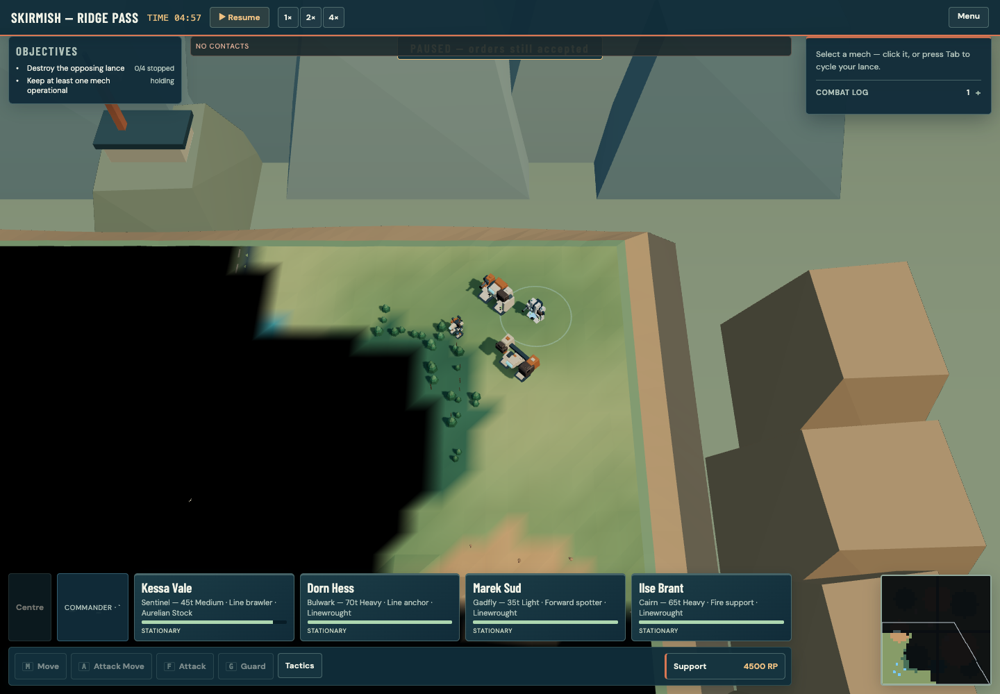
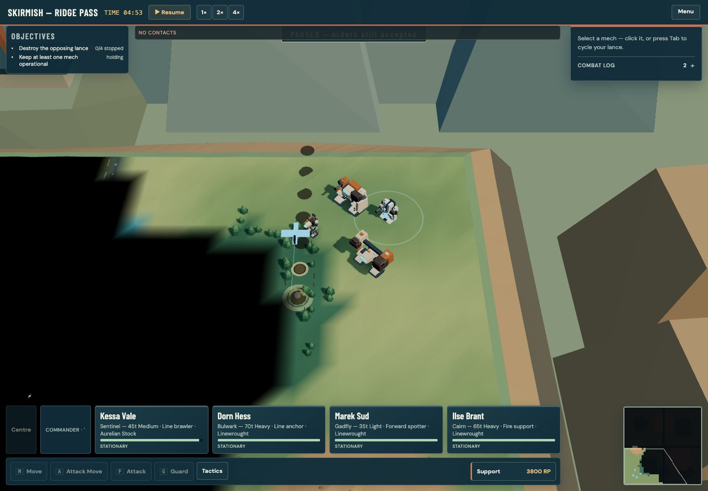
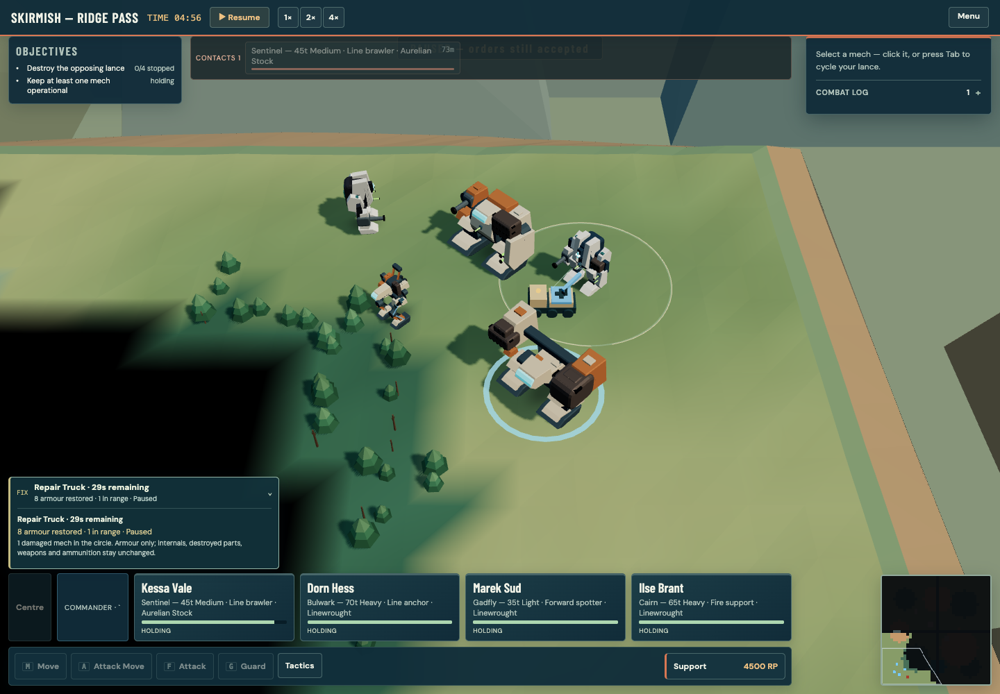
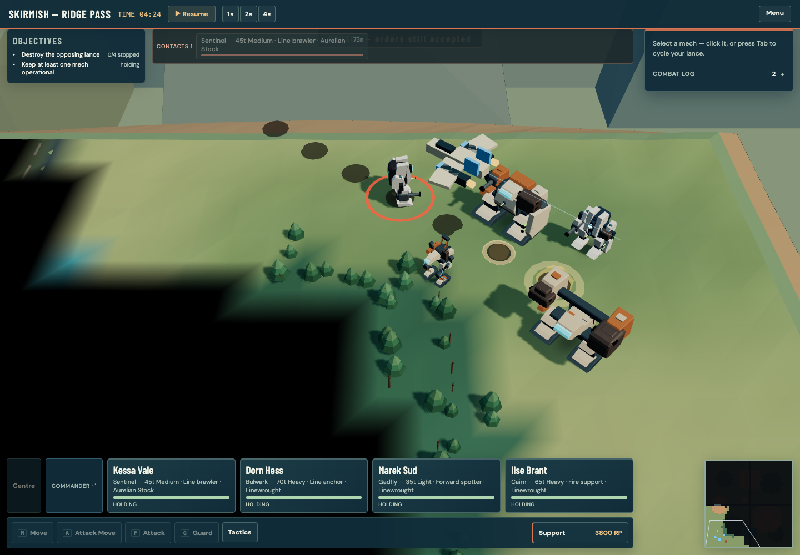
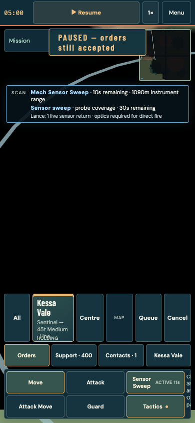

# Sensor and support feedback

This pass fixes actions that appeared to do nothing while paused and makes
support arrival, work and departure visible on the battlefield.

## Sensors while paused

Two faults were confirmed. A pilot's Sensor Sweep activated its ability but did
not refresh the resulting contacts until simulation time advanced. A zero-delay
Sensor Probe also waited in the support queue until the next tick. Both now
refresh the relevant sensor picture immediately, including while paused,
without advancing movement, weapons, the mission clock or random rolls.

Ordinary mech sensors work automatically. Fitting a **Deep Scanner** extends
that passive reach; it has no separate activation button. **Sensor Sweep** is a
pilot ability, available to pilots who have it, and temporarily extends the
machine's sensors. **Sensor Probe** is a paid support call placed on the map.
The readout distinguishes active mech sweeps from probe coverage and shows
remaining time, instrument reach where applicable, and current coarse returns.

Instrument range is not guaranteed detection distance. Weather, signature and
concealment still matter. A sensor return does not reveal the hostile's identity,
weapons, exact position or optical terrain. It can guide eligible indirect fire;
direct fire still needs optical sight.

## Calling support

Selecting a support call costs nothing. Its button shows the price, arrival
delay and any RP shortage. After selection, placement instructions and a cancel
control remain visible. A valid placement spends RP immediately, including
while paused. Delayed calls then follow the mission clock.

The status above the command dock shows the next arrival and, when appropriate,
**Paused — resume to dispatch**. Expand it to inspect other queued calls and
active repair teams. An armed call can still be cancelled if the RP balance or
available reserves change before placement.

Invalid coordinates, off-map targets, an invalid approach direction, insufficient
RP and calls after mission end are refused before payment or queuing. Repair
teams and reinforcements require passable ground. A reserve already assigned to
an inbound drop cannot be purchased again. A refused call remains armed so the
commander can choose another point.

## What a repair team does

Move damaged friendly machines into the marked circle after arrival. The team
restores front and rear armour on surviving locations for the authored service
duration. It cannot repair internal structure, rebuild destroyed parts, replace
weapons or refill ammunition. The rate and duration come from the support rules,
and no repair is applied after the service period expires.

The active status reports time remaining, friendly machines in range, and armour
actually restored. It counts applied repairs, not the team's theoretical output.
The expanded view explains when no damaged machine is receiving service.

## Visible support work

An Air Strike now has an aircraft approach, a marked strike lane, ground impacts
and a departure. Its marker follows the actual damage footprint and timing;
the aircraft is presentation, not a new combat unit.

Repair support arrives by airlift as a recognisable service vehicle. A deployed
crane, service links and welding effects show which damaged machines it is
working on. The ground circle shows the repair area and remaining service time,
then the vehicle departs. If a mech crowds the delivery point, the visible truck
can park beside it. That presentation offset never moves the healing circle or
changes which machines receive repairs. Low-effects and reduced-motion settings
retain the essential markers while simplifying movement and detail.

## Review and validation

Diagnostic tests cover paused activation, sensor privacy, payment/refusal rules,
reserve allocation, actual armour accounting and exact expiry. Browser fixtures
exercise real controls on desktop and phone; render checks inspect the visible
service lifecycle. These controlled fixtures are automated checks, not human
playtests or evidence that new players find the controls intuitive.

Run focused checks with:

```sh
npx vitest run src/sim/supportLifecycle.test.ts src/sim/sensorProbePayoff.test.ts \
  src/ui/mechSensors.test.ts src/ui/supportStatus.test.ts
```

The dedicated browser review is
`node tests/e2e/support-services-review.mjs` with `BASE_URL` set to the local
review server. Final gate results belong in the delivery record and pull request.

Earlier repair and air support presentation:




Service work, a strike and phone sensor feedback:




