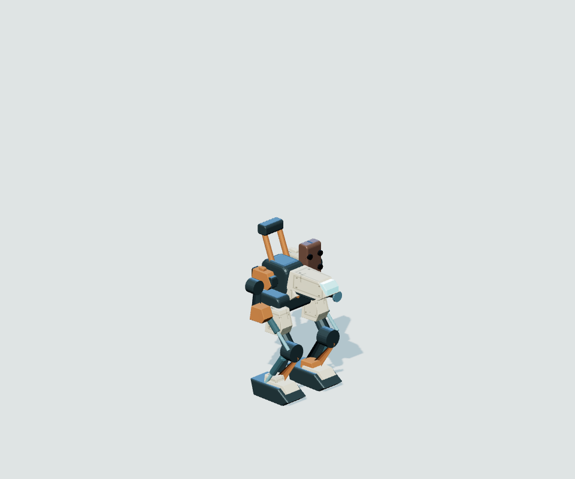
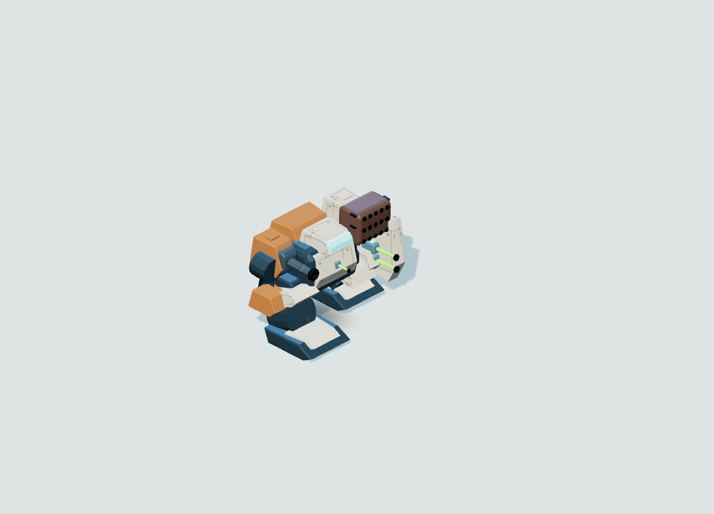
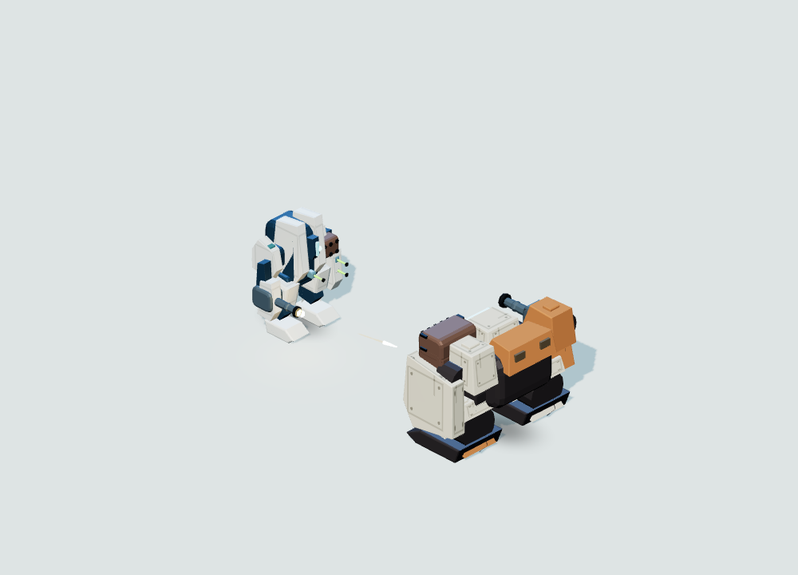
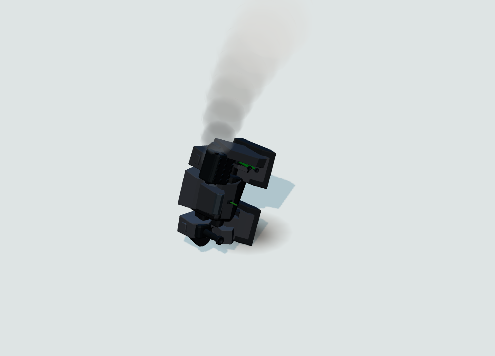

# Battlefield mech fidelity

The Ironwork and Monolith silhouettes stay intact. Large armour surfaces now read as manufactured pieces: broader bevel highlights, local panel joins and fasteners on Linewrought machines, and restrained ceramic panel seams on Aurelian machines. These finishes are procedural and stay attached to animated or detached plates. Small fittings, glass and bearings do not receive the pattern.

Exposed Linewrought actuators have fixed outer sleeves and moving shafts in the existing single instance batch. Arms counter-swing during travel, with quieter motion for Aurelian machines. Shooting stabilises that follow-through; reduced motion omits it. Existing foot contact and terrain solving remain authoritative.

Cannon barrels have reinforcing collars and recessed muzzle throats in their original meshes. Weapon housings distinguish pale energy equipment, steel ballistic receivers and warm missile housings. Rotary barrels rotate forward through repeated shots, instead of jumping a full turn and unwinding. Energy cores brighten when firing and settle to their idle level. Disabled mounts and entire wrecks keep those cores dark.

## Inspected before and after

These captures use identical cameras, lighting, scale and loaded designs. They come from `tests/e2e/mech-design-review.mjs`, which builds the actual models in an isolated browser without loading the app or touching saves.

| Machine | Before | After |
| --- | --- | --- |
| Gadfly / Linewrought |  |  |
| Sentinel / Aurelian |  |  |

All 78 model views across 16 chassis passed without browser errors, clipping or Low FX detail violations. The full local gallery and diagnostics are under `reports/battlefield-fidelity/mechs-after/`. Front, rear, damaged, tactical and silhouette captures were retained. Representative heavy-machine frames were also inspected.

The fixed tactical review cost, including its lighting/shadow passes, remained bounded:

| Loaded machine | Draw calls before / after | Geometries before / after | Triangles before / after |
| --- | --- | --- | --- |
| Gadfly | 89 / 89 | 55 / 55 | 8,362 / 9,130 |
| Sentinel | 78 / 78 | 48 / 48 | 6,758 / 7,646 |

Armour construction patterns add no texture or draw call. Every current weapon still passes the existing budget of at most four tactical draws and 900 tactical triangles. No dependencies, external assets, combat statistics or simulation code changed in this portion of the work.

## Motion and destruction checks

The final motion review captured 65 states through the real `UnitViews`, `Locomotion`, weapon rigs and battle-effects presentation. It reported no browser errors or clipped frames. Both factions made successive alternating sole contacts; walking kept object, geometry and material counts stable. Representative walking, recoil, airborne, damaged and settled-wreck frames were inspected. This is a scripted presentation fixture, not a completed campaign or a battle-balance result.

TypeScript and scoped lint checks passed. The final targeted geometry, material, articulation, locomotion, contact, weapon and lifecycle suite passed **77 tests across 13 files**; the subsequent complete rendering suite passed **452 tests across 83 files**. Full local final captures are under `reports/battlefield-fidelity/motion-final/`. This 65-frame run followed the detached-emitter and flame-opacity corrections, softened wreck smoke and reduced-motion water integration. It completed with zero errors or clipped frames; the representative images above were refreshed from that run and inspected.
