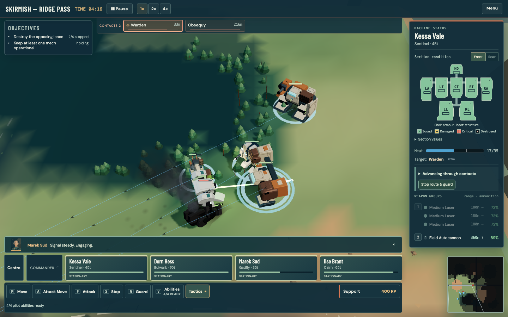
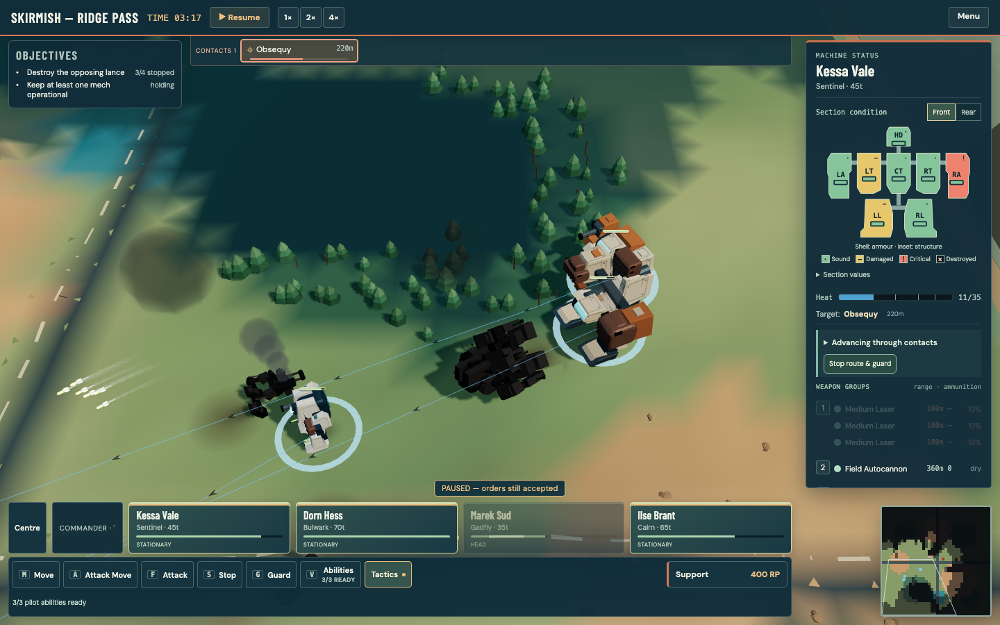
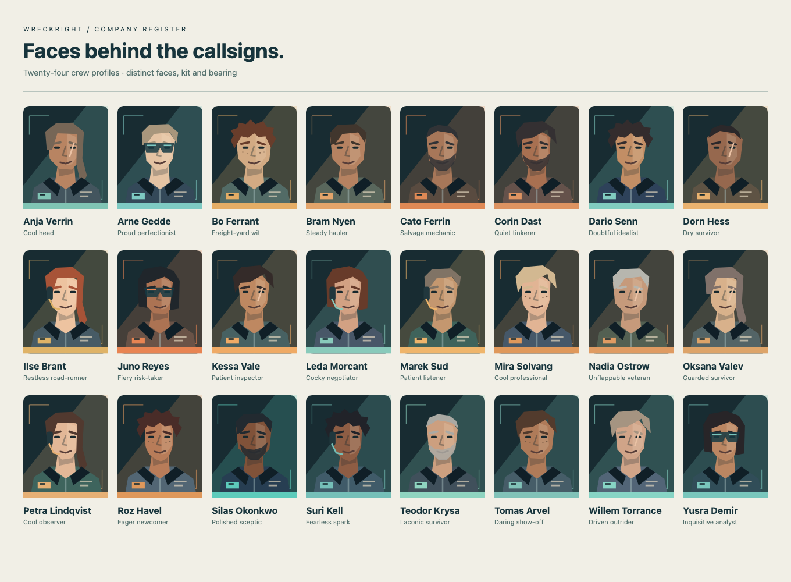
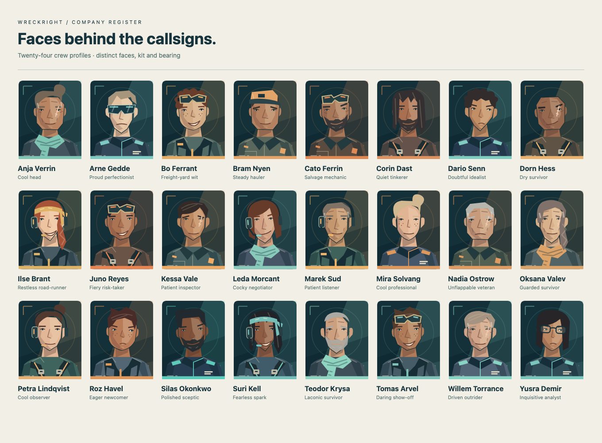
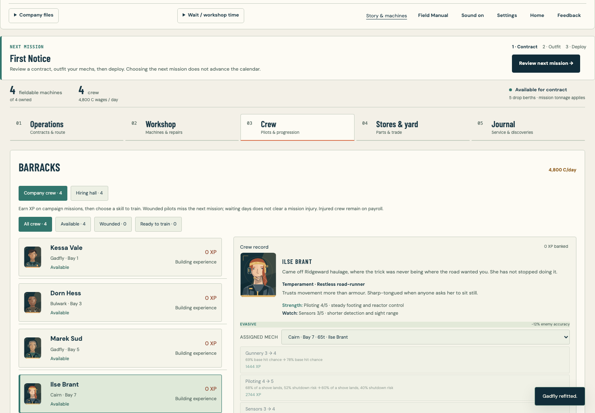
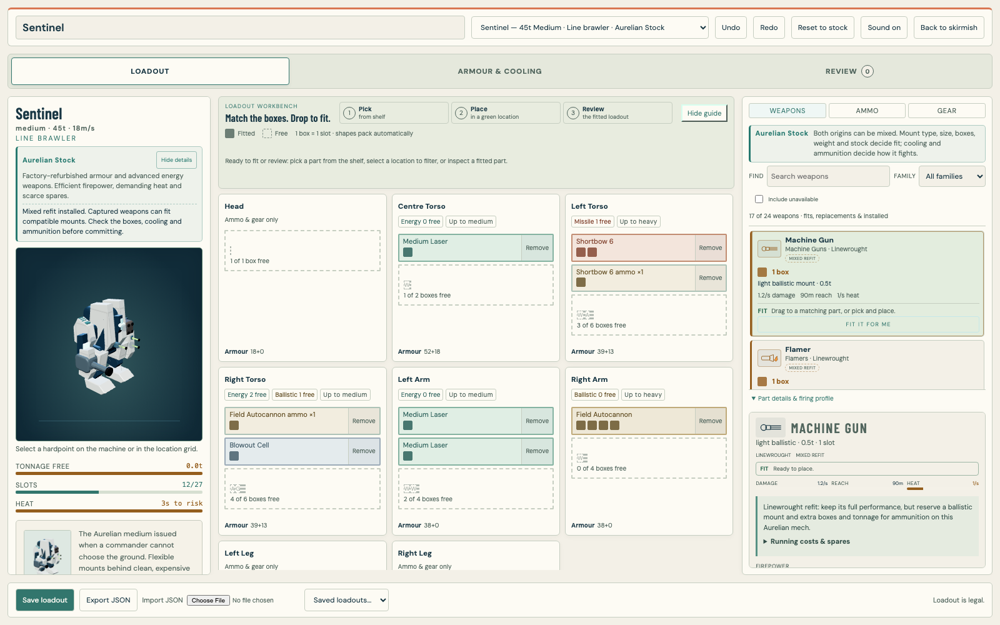
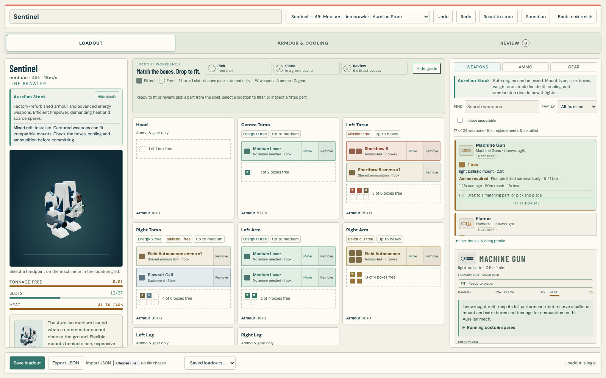
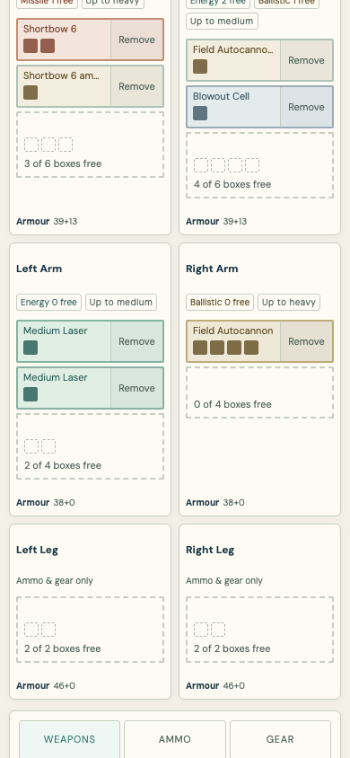
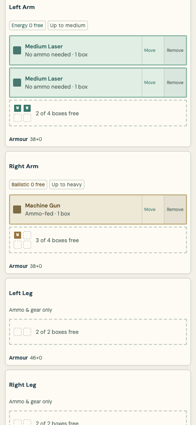
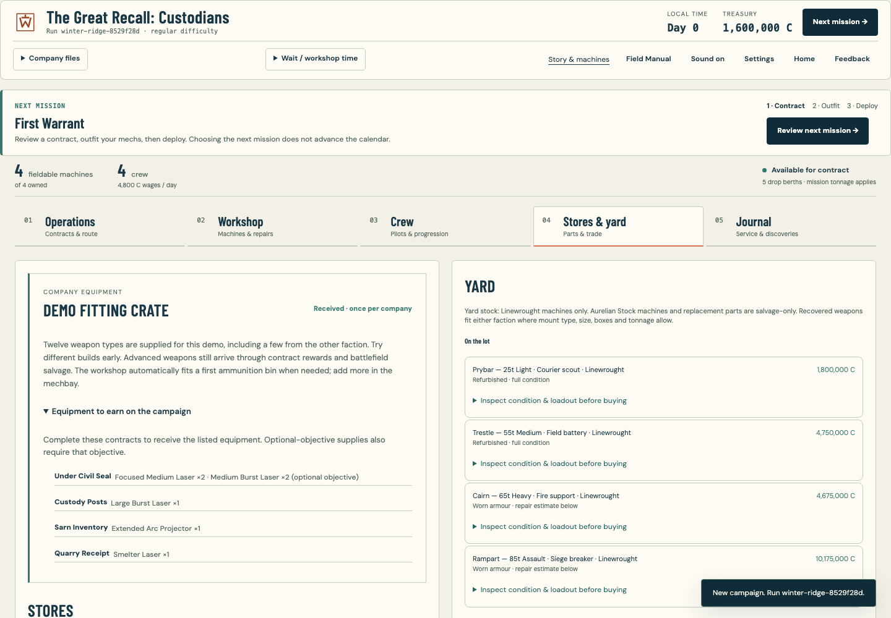

# Battlefield visuals, crew identity and fitting

The battle now presents clearer mechanical construction, richer weapon fire and physical damage, while the workshop represents equipment space with compact two-dimensional box groups. Both campaigns supply a broad starting demo crate and award advanced weapons on later contracts. This continues the current game on top of the economy and command-flow build; combat rules, weapon statistics, mission tonnage and legacy save keys remain intact.

## Mechs, movement and weapons

Both machine cultures retain their authored silhouettes. Broad bevels catch light, ceramic and steel finishes separate more clearly, and local panel joints and fasteners add construction detail. Exposed Linewrought actuators telescope during the gait. Arms counter-swing with the chassis, then stabilise while aiming or firing. Rotary barrels spin continuously instead of reversing through their recoil cycle. Guns have machined collars and recessed muzzle throats, while energy optics brighten only when powered.

The normal field camera starts at 400 rather than 470, bringing the models closer without changing wheel zoom or the Commander overview. Retina rendering and bay previews allow up to 2x pixel density. Supersampling is limited around a six-million-pixel budget, with a native 1x floor on larger displays. Low FX retains 1x rendering.

The inspected paired model captures and draw-count comparison are in [the mech fidelity review](battlefield-mech-fidelity.md). All 16 chassis received front, rear, damaged, tactical and silhouette checks. Model draw calls and geometry counts stayed unchanged in the fixed Gadfly and Sentinel comparisons; their additional bevel geometry raises triangle counts modestly.

Laser beams have hot inner cores, burst lasers remain separated pulses, arc projectors connect through angular discharges, and flamers emit tapered streams. Finned missiles carry motor exhaust and smoke trails; autocannon shells and rail shots have different wakes. Hits and terminal explosions use layered fireballs, ground pressure rings and tumbling armour fragments. Severed weapon optics lose their power instead of continuing to glow on the ground.

Smoke edges are softer, forest fire has layered flame colours, and water highlights move in a spatial flow. Reduced motion freezes the water shimmer; Low FX suppresses the new decorative batches. Effects retain fixed capacity, optical-visibility checks and resource disposal. The [effects comparison and performance limits](battlefield-visuals/effects/review.md) distinguish active GPU cost from stable object/resource counts. This is a richer stylised renderer, not a claim of photorealism or measured hardware frame-rate improvement.

A separate play through ordinary skirmish controls covered 103 seconds of live movement, firing and losses, with three of four company mechs still operational at the stopping point and no browser errors. It was paused for review before the mission ended; it is not counted as a victory. The same fixed-capacity effect paths are checked under sustained firing fixtures.

## Individual pilots

All 24 pilots now have authored combinations of face shape, expression, hairstyle, age, accessories and clothing. Their portraits retain the graphic expedition palette: work coats, flight vests, harnesses, scarves and officer uniforms support the character already described in each bio. Template IDs still resolve portraits for existing saved crews and hires. The same vector art stays sharp in the roster, deployment cards, radio and small thumbnails.

| Before | After |
| --- | --- |
|  |  |

## Two-dimensional fitting

Weapon size and every compartment's full capacity now use regular groups of square cells. Occupied cells distinguish weapons, ammunition and gear; outlined cells show free space, and the incoming footprint previews where a held item will consume it. The preview has reserved space so drop targets stay fixed while dragging. The groups pack automatically: box count is the existing slot rule, so a legal fit does not gain an arbitrary rotation or shape requirement. Mount type, weapon size class, tonnage and available stock remain enforced.

Installed weapons can now be dragged to another compatible compartment. This uses the same edit transaction as the keyboard/touch Move action and preserves the weapon count, ammunition and undo history. Incompatible drops leave the original build intact and explain the refusal. A rejected drop also preserves the shelf filter, so the source weapon remains available for another attempt. Shelf-to-compartment drag and saved custom configurations were tested with actual pointer movement and release.

Ammo-fed weapons have an explicit requirement badge and explain automatic fitting of their first bin. Energy weapons state that no ammunition is needed. Installed cards distinguish ammunition-fed weapons, shared bins and gear. Supply cards and yard descriptions use the same grouped box language.

The first workshop opening can also be cancelled while its deferred code is loading, either with Escape or the visible Cancel button. Once the workshop has loaded, the existing unsaved-draft confirmation resumes ownership of Escape. A deliberately delayed-module browser check verifies cancellation, focus restoration and save preservation.

| Desktop before | Desktop after |
| --- | --- |
|  |  |

| Phone before | Phone after |
| --- | --- |
|  |  |

## Demo supplies and progression

Each new faction campaign receives **12 loose weapon types** plus ammunition containment equipment. A few weapons come from the other culture so players can try the existing compatibility tradeoffs early. New companies receive the crate automatically. Existing saves may collect the same one-off crate from Stores & yard; the grant merges inventory, preserves credits and day, and records its claim using the existing persisted claim ledger. Finished companies cannot collect it.

Later guaranteed rewards give a reliable equipment progression alongside the existing market and salvage routes:

| Campaign | Contract | Equipment |
| --- | --- | --- |
| Linewrought | First Attestation | Two Focused Medium Lasers |
| Linewrought | Broken Ironmuster | Canister Cannon |
| Linewrought | The Cold Yards | Gauss Rifle |
| Linewrought | Blackglass Attestation | Longshot 20 |
| Aurelian | Custody Posts | Large Burst Laser |
| Aurelian | Sarn Inventory | Extended Arc Projector |
| Aurelian | Quarry Receipt | Smelter Laser |

Existing optional supply rewards remain. Stores explains equipment to earn and flags rewards tied to optional objectives. These rewards are not an exclusive technology lock: the existing random market and salvage may provide other equipment earlier. No weapon's combat statistics changed.

## Verification

- TypeScript and ESLint passed.
- Final fast suite: **3,290 tests across 409 files passed**, including the rejected-drop shelf-context regression.
- Focused browser additions: **15 fitting checks** and **22 demo-supply checks** passed in isolated profiles. These are also wired into the complete playthrough.
- Both faction flows verified new and legacy crate claims, exact persistence, no cash/day charge, Stores-to-refit navigation and a legal commit consuming one owned spare.
- Mech review: **78 model views across 16 chassis**; motion review: **65 scripted rendering states**. These are presentation fixtures, not claims of campaign victories.
- Final balance and campaign acceptance: **25 tests passed**.
- Hosted and single-file release builds passed; the self-contained file is **3.62 MB**. Its final offline smoke test covered artwork/fonts, all 16 wiki dossiers, archive reload, workshop refit, contract acceptance and deployment with zero external requests or browser errors.
- Complete final browser playthrough: **1,092 of 1,092 checks passed**, including the fitting, demo-supply, cold-loading and rendering resource regressions, campaign journeys, skirmish setup, saves, and desktop/phone/tablet controls.

Original player saves were not cleared or overwritten by tests. All browser work used isolated sessions; no native desktop takeover was required.
