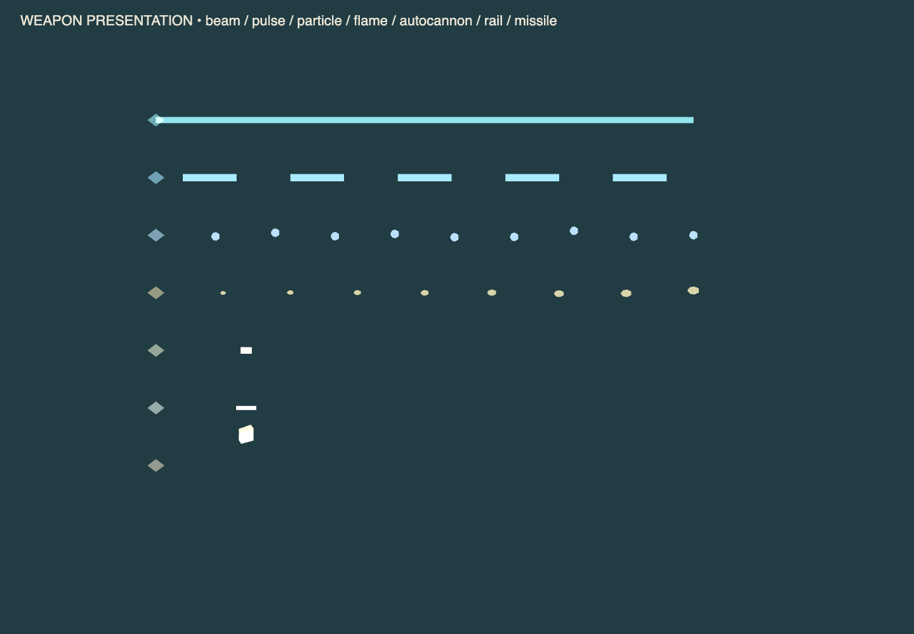
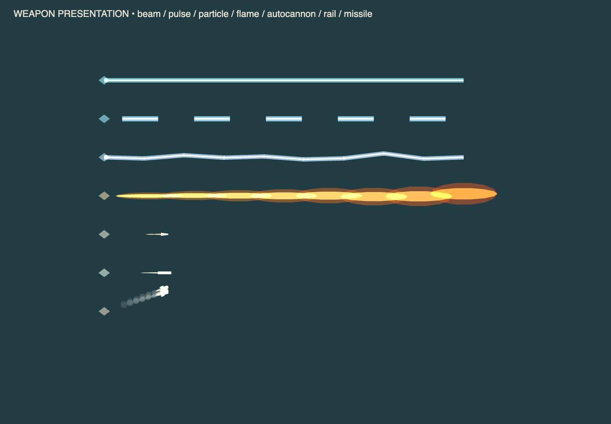
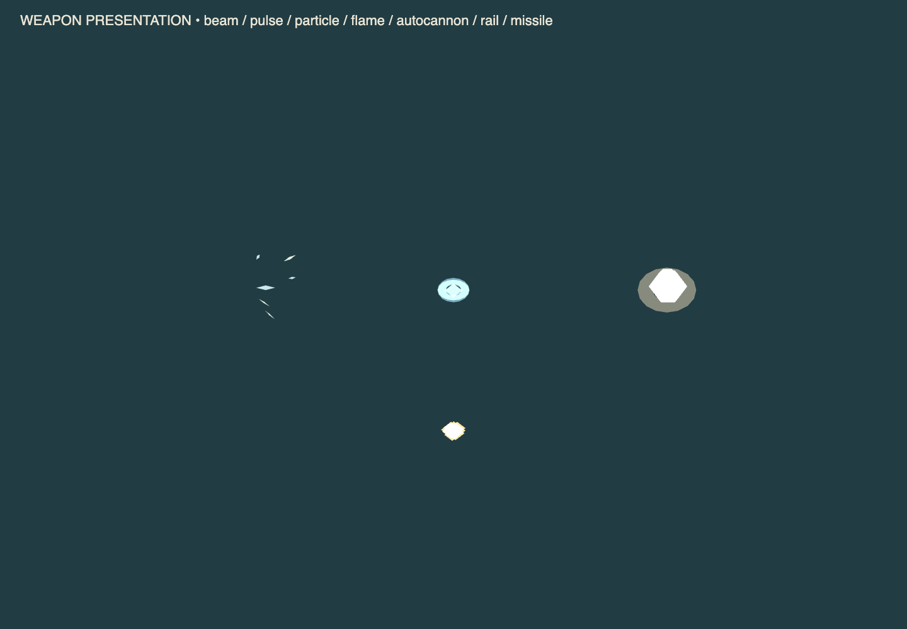
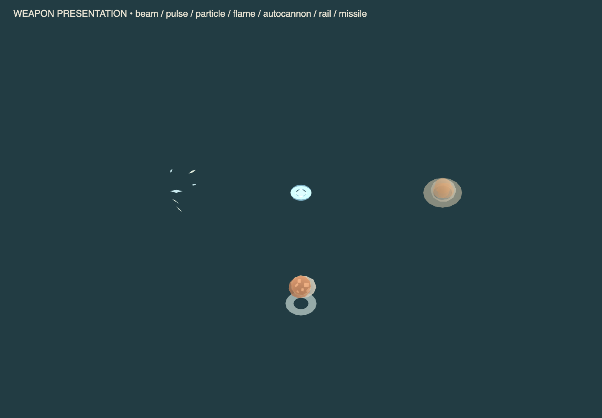
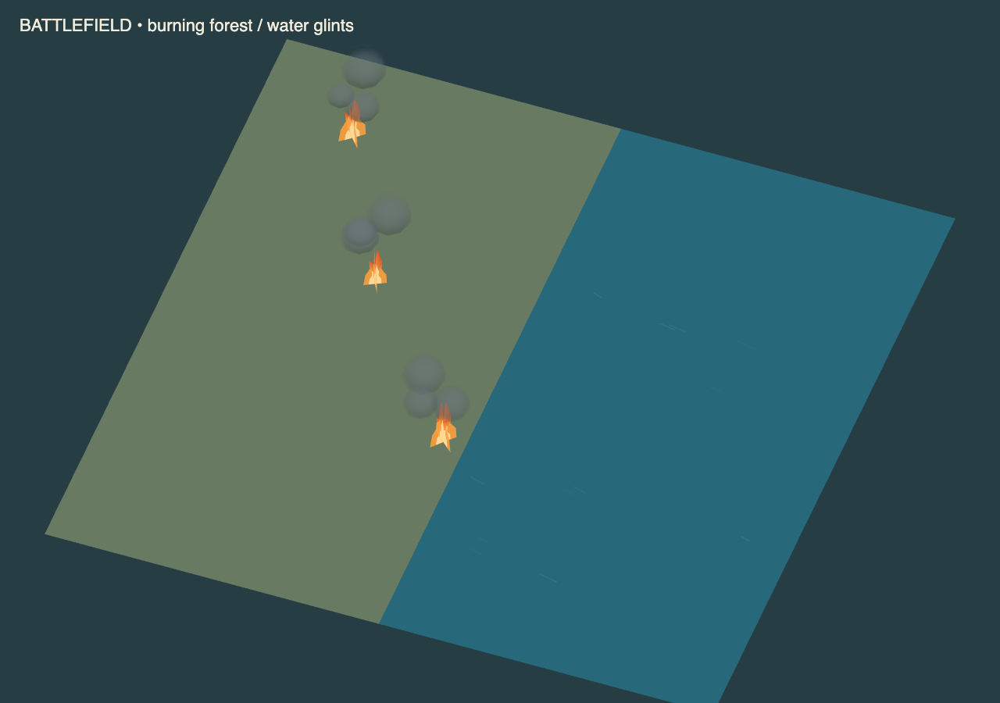
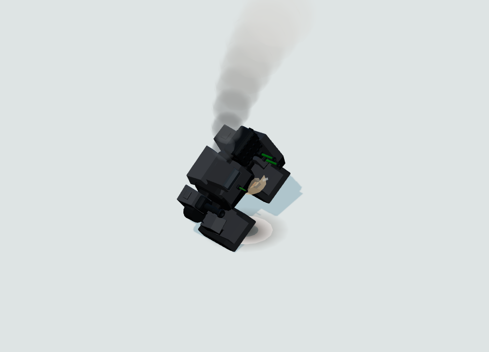

# Weapon and battlefield effects

The firing families now have distinct silhouettes: lasers retain one continuous beam with a white core, pulse weapons keep separate packets, particle weapons make a connected angular discharge, and flame is a tapered orange tongue with a hot centre. Autocannon rounds have short tracer wakes, rail slugs leave a longer thin streak, and finned missiles carry a motor glow and short curved exhaust trail. Contact endpoints, projectile timing, salvo counts and combat statistics are unchanged.

Critical damage sheds small armour plates. Ammunition and terminal destruction combine the existing sparks with layered fireballs and a pressure ring on the actual ground. The existing Linewrought whole-part separation now bounces and slides before settling on the rotated part's lower surface. Aurelian still retains its blackened structural shell; its small fracture debris comes from the effect layer.

Forest fires have irregular two-tone tongues rather than plain orange triangles. Fire and wreck smoke have feathered edges rather than solid polygon silhouettes. Water glints follow one wind direction and flow in spatial phases; the geometry does not move into neighbouring dry tiles.

## Reviewed comparisons

These are controlled render fixtures of the actual game classes, not evidence of a campaign victory. Both members of every pair use the same camera, lights, timing and content. The screenshots were opened and inspected. The game's separate motion review covers complete mechs firing, losing parts and collapsing.

The final 65-frame motion run completed after all source corrections, with zero browser errors or clipped frames. Final walking, cannon discharge, detached arm, terminal collapse and settled-wreck views were inspected. A first attempt exhausted its two-minute harness allowance at frame 63 while other verification was running; it is preserved separately under `reports/battlefield-fidelity/motion-final-preliminary/`.

| Before | After |
| --- | --- |
|  |  |
|  |  |
|  |  |

## Verification and cost

- TypeScript passed. The complete rendering suite passed **452 tests in 83 files**; rendering lint passed.
- Six added tests check beam-core contact/retirement, hidden incoming missile exhaust, immediate Low FX/reduced-motion suppression, high torso blast grounding, severed-arm contact/bounce and near-expiry flame opacity.
- Independent review caught flame lobes fading their RGB into opaque black after changing to normal blending. They now fade with per-instance alpha, retaining their hue. [The near-expiry frame](after-late-flame.png) was inspected after the fix; the regression verifies transparency and complete retirement.
- Existing 1,000-event stress tests preserve the fixed scene, geometry, material and instance-buffer identities. Effect admission remains **448 slots**. No per-shot mesh or material is created for the new firing/impact layers.
- An isolated 240-frame mixed-fire stress fixture measured **19 peak effect draw calls**, versus 11 before. The richer effects increase peak submitted geometry from 52,720 to 117,864 triangles in that fixture. These are effect-layer counts, not whole-game frame rates.
- Empty and fully retired pools now submit **zero draw calls and zero triangles**, versus 11 draws/52,720 triangles before. Allocated capacity remains fixed; submission ends at the highest active slot. Disposing the fixture returns the renderer to zero tracked geometries and textures.
- The final isolated night fixture passed all **14 checks**. Its complete-volley ABBA timing thresholds are unchanged: median contrasts were 8.8 ms on activation and 8.4 ms on the following frame, against the 20 ms threshold. Quiet rendering used 473 draws; the volley used 480/482, consisting of the same 473 non-shot draws plus 7/9 active shot batches. The helper now counts submitted shot batches separately, asserts their fixed 19-batch ceiling, and retains the existing two-draw limit for lighting and other presentation. This accounts for the removal of formerly submitted empty batches rather than relaxing the timing gate.
- Low FX removes weapon cores, wakes, extra blast shapes and fragments. Reduced motion suppresses wakes/tumbling and holds destruction expansion still. Existing essential trajectories, impacts and fog checks remain.
- No simulation, weapon-stat, save-key, dependency or external asset changes. Browser fixtures recorded no page errors.

The machine-dependent timings in [the raw stress result](performance.json) measure headless browser submission and are not a claim of gameplay FPS. Integrated desktop/mobile checks remain the release gate.
