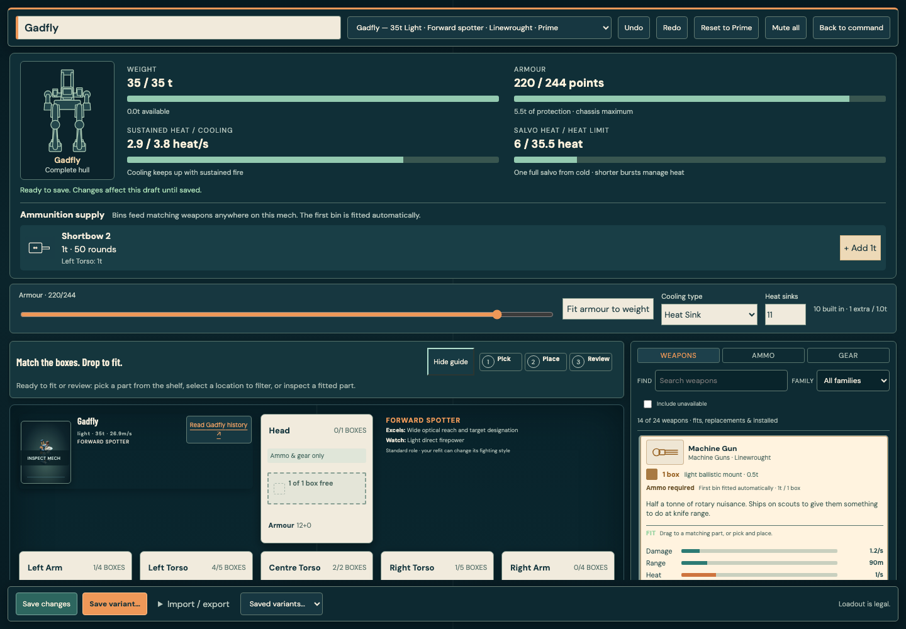
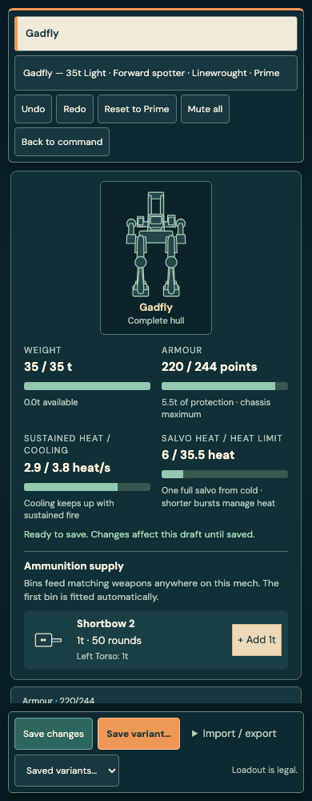
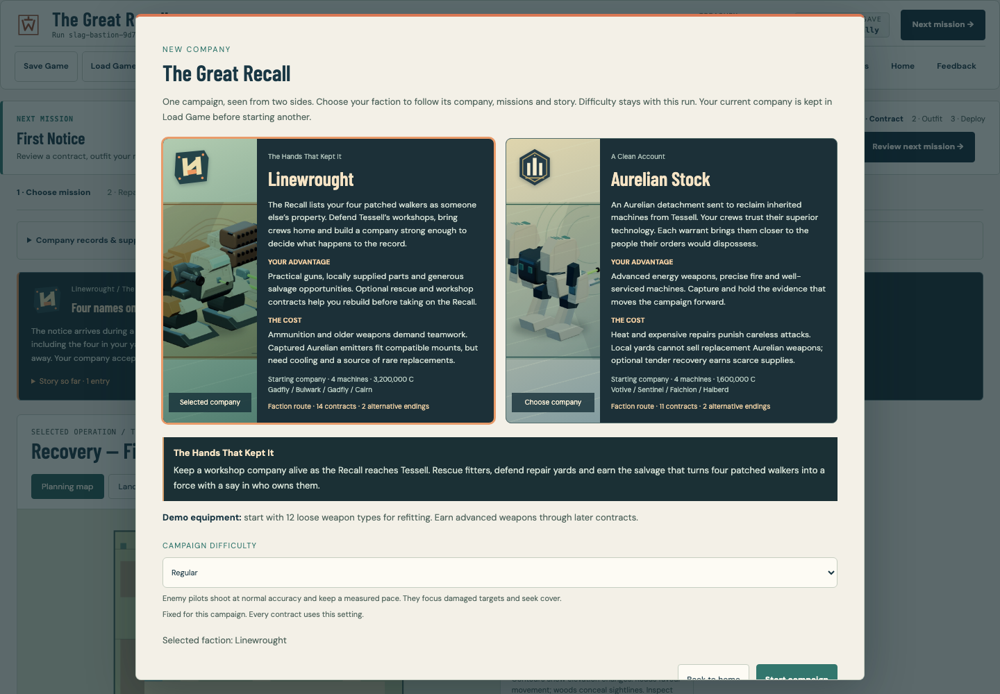
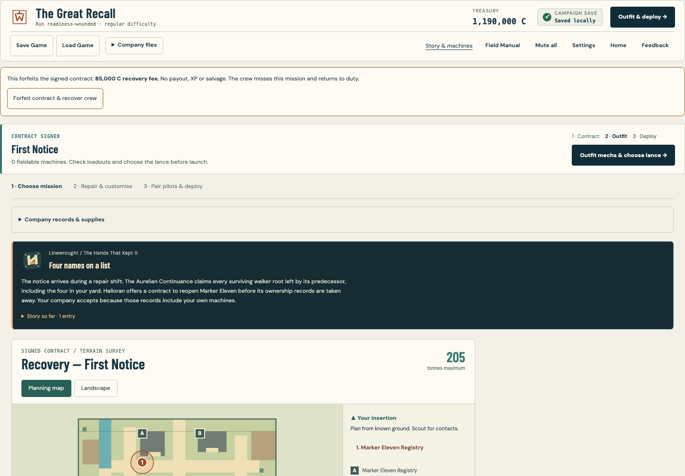

# Campaign entry and MechBay release review

The Great Recall now has one campaign entry point. Selecting Linewrought or Aurelian Stock directly selects that faction's existing story route. The redundant campaign dropdown is removed. Existing campaign identifiers and parked saves remain compatible.

The MechBay has a dedicated complete hull drawing beside four capacity meters. Weight and armour show fitted totals against actual chassis limits. Heat shows sustained generation against cooling and a full salvo against heat capacity; these are planning values, not the mech's current battle temperature. Over-limit values remain visible with an orange bar and text. Armour uses the same active-location maximum as the armour editor.

## Playability finding

The entirely wounded crew recovery action was inside collapsed company details. It is now directly below the campaign header. An isolated browser fixture exhausts the authored relief roster, injures the remaining pilots and verifies that the visible forfeit action recovers them without XP, salvage or victory payout. This passes in Chromium and Firefox.

## Validation

- Fast suite: 3,490 tests passed across 433 files.
- Type checking, lint, production build and self-contained itch build passed. The latter is 7.16 MB with no external requests.
- New campaign choice, complete Gadfly outline, capacity bars and crew-recovery browser checks: 11 passed in Chromium and 11 in Firefox, covering 1440, 1024 and 390 pixel layouts.
- Complete browser regression playthrough: 1,282/1,282 checks passed, covering training, combat, support services, campaign flows, fitting, save/reload, skirmish configuration, accessibility and mobile interactions.
- [Live tactical campaign audit](campaign-readiness/live-campaigns.md): all four endings reached through real simulation battles, with repairs, casualties and save/reload between operations. The four completed routes include 33 battles, including one loss and retry. Three unsuccessful earlier seed attempts are explicitly retained in the report. Optional contracts are skipped by this bounded main-route audit; this is not a human difficulty assessment or an unbeaten first-attempt run.
- No combat rules or balance data changed in this round.

## Visual evidence

Before and after screenshots were captured and inspected. The complete hull remains inside its own SVG view box and does not sit beneath rack cards.

## Release status

Local preview and both build artifacts are updated. No itch.io upload or main-branch deployment was performed in this round. Changes remain on the existing review branch with the preceding variants and immediate-repair work.
