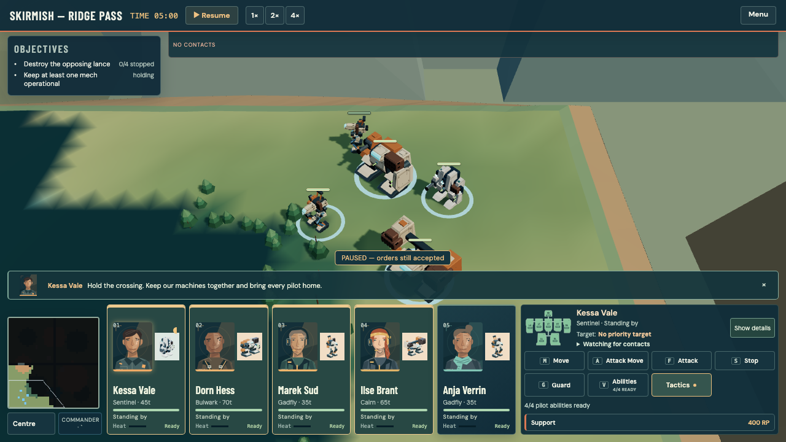
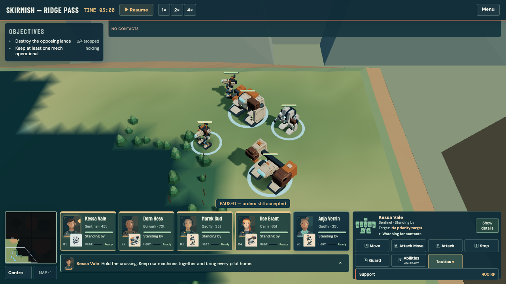

# Campaign saves and clearer deployment

Players can keep named campaign checkpoints, choose a saved company from the main menu, and start another run without silently replacing their progress. Skirmish faction choices now restrict both stock and saved hulls. Battlefield previews stay still during setup, and a smaller command dock reserves space for radio messages.

## Campaign files

- Home offers Continue Campaign, Load Game and New Campaign. Save Game and Load Game are visible in the company header.
- Named checkpoints retain the complete company: mission progress, resources, damage, pilots, equipment and deployment configuration. These are company saves between missions, not snapshots of a running battle.
- The load list includes the current company, existing parked faction companies and named checkpoints. Details identify faction, difficulty, day, treasury, crew and mission progress.
- Loading, importing, restarting or starting another company preserves distinct prior versions first. Storage failures hold the switch and retain the active company. Damaged originals remain exportable.
- Up to 24 checkpoint and safety records are retained. No record is silently evicted. Overwrite and delete require explicit confirmation; individual records can be exported and imported.
- Legacy `ironline.campaign` and faction-slot saves remain readable. The new library uses `ironline.campaign.saves`; normal autosaving remains in place. Browser storage stays local to that browser and address, so exported files are the portable backup.
- Home-route loading and new games reposition the viewed-debrief marker for the selected company. A previous run can no longer suppress the early mission reports in a fresh campaign.
- On phones, the waiting disclosure occupies a full-width header row, so its panel and paid waiting controls stay within the screen after Save Game and Load Game wrap.

## Skirmish and camera

- Each side keeps its explicitly chosen faction independently, including across map changes and reloads. Mixed company remains Mixed even when only one faction happens to be fielded.
- The selector filters stock designs and saved refits by hull faction. An empty berth opens an eligible starter chassis, and callback/commit checks reject incompatible hulls.
- Salvaged weapons from either faction remain interchangeable on compatible hulls. This change constrains the chassis, not weapon provenance.
- Faction and roster persist together in one write while retaining the legacy stored-array format. Failed writes retain the edited force for the current session and show a warning.
- Renderer creation no longer triggers the opening camera move. The existing deployment path owns it, including real battle restarts; reduced-motion preferences still skip it.

## Compact command dock

Desktop cards are 100 pixels tall instead of 212. The desktop dock stays 172 pixels tall whether the radio is silent or speaking; previously it grew to 267 pixels during a report. At 1280 × 720 this frees 95 vertical pixels during chatter.

Portraits, mech thumbnails, health, heat, status and selection remain visible. Full machine details still open on demand. Radio and order receipts occupy reserved space inside the dock rather than expanding into the tactical map.

The phone layout reserves enough room for the paired card and 44-pixel commands: its dock is 278 pixels rather than 250, but a radio report no longer shifts the cards by 61 pixels or squeezes the controls. Landscape keeps a fixed 124-pixel dock. Long messages scroll within their own channel; support details remain available on request.

The same five-machine scene at 1280 × 720, before and after:

Further inspected views: [Home](campaign-saves-clear-deployment/home-after.png), [desktop Load Game](campaign-saves-clear-deployment/load-desktop.png), [phone Load Game](campaign-saves-clear-deployment/load-phone.png), [phone battle](campaign-saves-clear-deployment/dock-phone-after.png), [landscape battle](campaign-saves-clear-deployment/dock-landscape-after.png). Exact before/after dimensions are in [dock measurements](campaign-saves-clear-deployment/dock-measurements.json).

Phone waiting-menu containment: [before](campaign-saves-clear-deployment/wait-phone-before.png) and [after](campaign-saves-clear-deployment/wait-phone-after.png). The panel's left edge moves from −159px to 35px at a 390px viewport; its actions remain 44px tall.

All browser checks and captures use isolated headless browsers; the user's desktop and saved games were not controlled.

## Validation

- Type checking and complete lint passed.
- Fast regression suite: **3,392 tests passed across 419 files**, with two workers.
- Complete integrated browser playthrough: **1,286 / 1,286 checks passed** on the final frozen source. Log: `reports/command-clarity/verified-playthrough.log`; inspected screenshots: `reports/command-clarity/verified/`.
- Both production builds passed; the self-contained file is **7.09 MB**.
- Both production artifacts passed New → Save → New other faction → Load → reload → Continue, exact complete-company comparison, faction-filtered Skirmish and compact-card deployment. Neither browser reported an error.
- Local preview ports 5219 and 5220 serve build `850e34485cd68fee`.

The browser fixtures now use legal deployable mech hulls, explicitly choose their intended faction, and verify that the ground-order tap reaches the canvas after closing the already-tested tutorial panel. Existing weapon profiles and order-change assertions remain intact.

No simulation, content balance, dependencies or audio assets are changed by this update.
