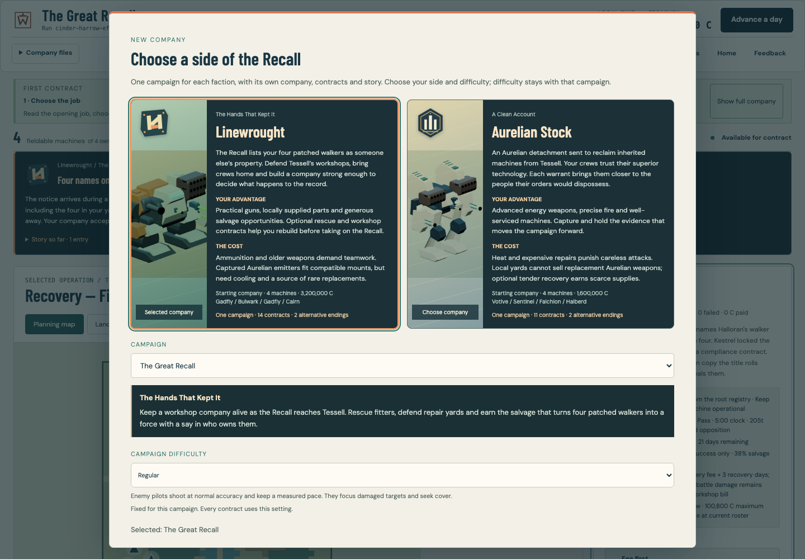
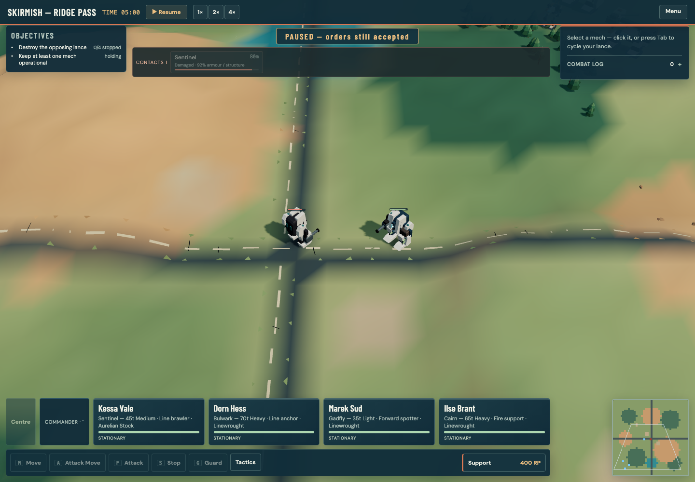
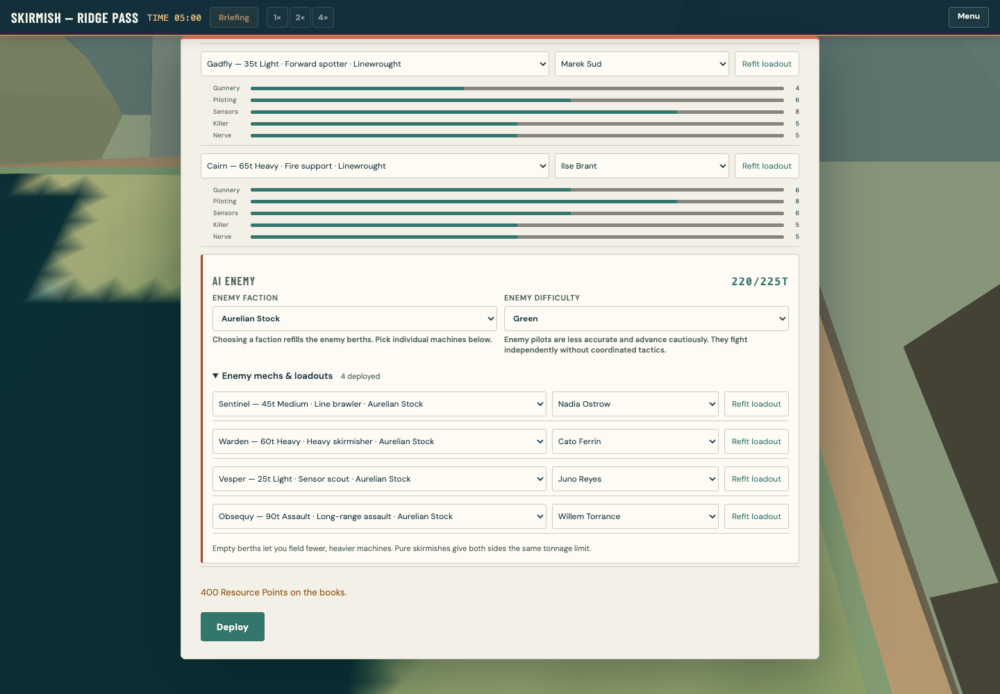
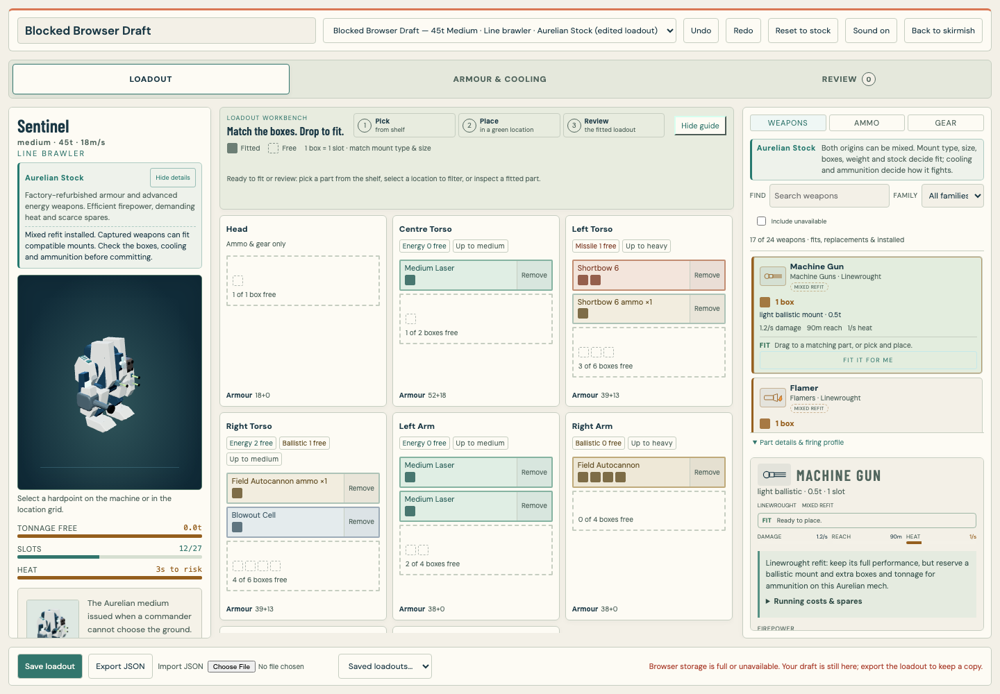
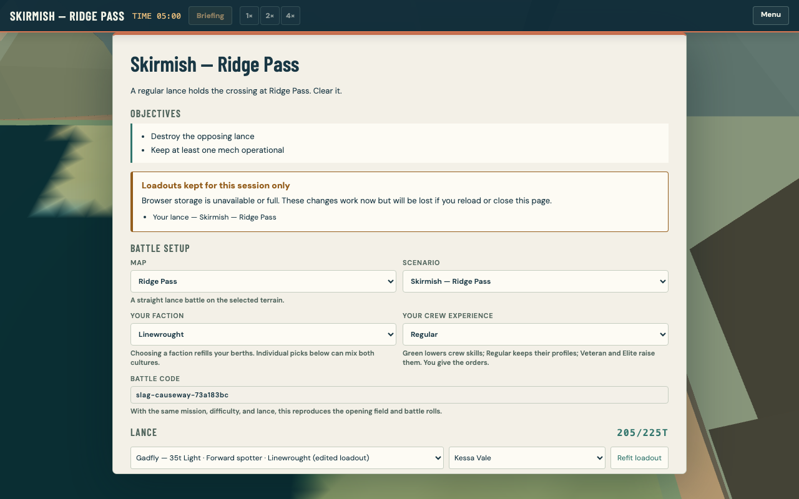
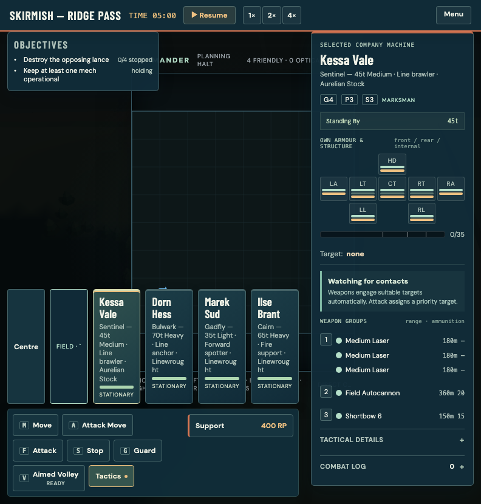
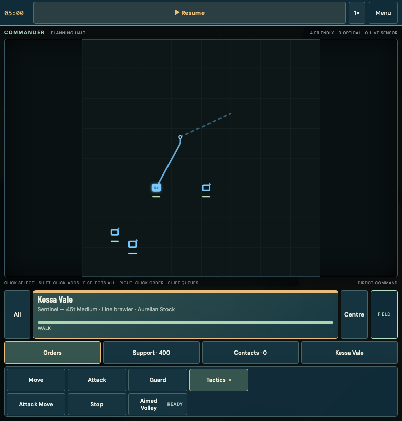
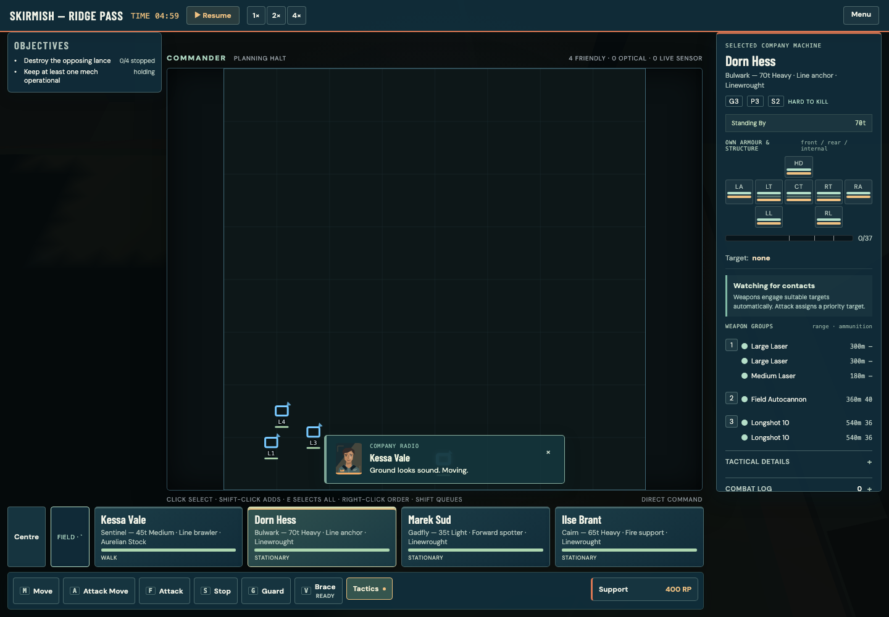
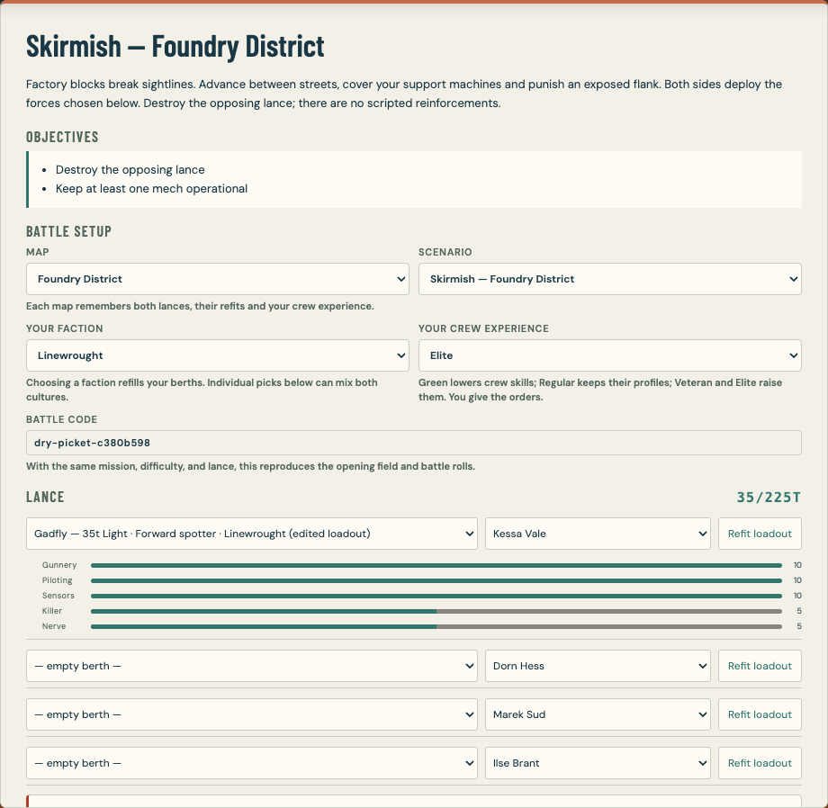
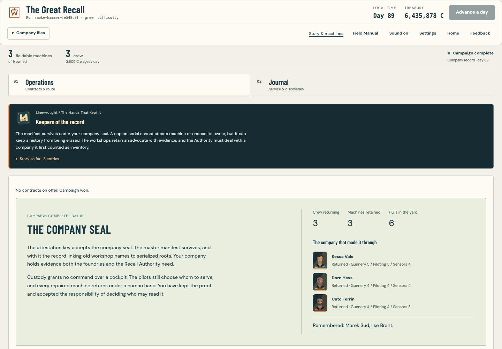

# Faction campaigns and mechanics review

This build develops the two existing faction campaigns, adds authored pilot
personalities, shows compact mech health in both tactical views, and gives the
player control over both forces in skirmish setup. It also fixes data-loss and
recovery problems found while testing the mech bay.

## Player-facing changes

- **Linewrought — The Hands That Kept It:** a workshop company protects its
  crews and repair yards, recovers equipment, and decides the fate of the root
  manifest. **Aurelian — A Clean Account:** a custody detachment follows a
  disputed warrant and must choose between export and local stewardship.
  Each has an opening, progress-dependent story entries and distinct endings.
  Existing campaign identifiers, mission graphs and saves remain compatible.
- Original vector faction insignia appear in campaign selection, the story
  panel, faction articles and all 16 mech dossiers. Campaign difficulty remains
  fixed at the start. Battle briefings now show the current faction contract's
  title and narrative rather than only its underlying mission template.
- All 24 pilots have a temperament and authored movement, engagement, guard,
  investigation and pressure remarks. The portrait radio panel uses text and
  its existing radio sound; there is no recorded voice acting. Chatter has
  cooldowns and cannot interrupt emergency or mission reports.
- Small health strips follow friendly and optically visible enemy mechs in
  the field and Commander views. Sensor-only dots do not reveal enemy health.
  Destroyed, ejected and hidden units do not retain bars.
- Skirmish offers six maps, independent faction presets and individual mech,
  pilot and loadout choices for both sides. Empty berths support smaller
  forces. Player crew experience and enemy AI difficulty are separate controls.
  Pure skirmishes use the selected forces; authored scenarios explicitly warn
  that their scripted reinforcements still apply.

## Bugs found and corrected

- Stock, saved-loadout and file-import selection could silently replace an
  edited mech. They now offer Save and switch, Discard changes or Keep editing.
  Delayed imports also check the current draft, ignore superseded or unmounted
  reads, and support retrying the same file after cancellation.
- Missing, blocked or full browser storage could crash a path or appear to save.
  The bay now retains the draft, reports the failure and permits JSON export.
  Skirmish roster failures now show a visible session-only warning and retain
  those edits when visiting the workshop. Each warning clears only after that
  particular roster is successfully saved.
- Names that collapse to the same saved identifier could overwrite unrelated
  configurations. Conflicting names now require a distinct name; intentional
  updates of the same named design remain supported.
- An imported unknown chassis could trap the bay without usable controls.
  Invalid chassis and non-mech imports are rejected before replacement.
- Generic CSS classes made a save-error message inherit an unrelated error
  overlay and made an enemy health strip expand into a 250-pixel contact card.
  Component-specific classes fix both. Field bars are verified at 38 by 4 pixels
  on desktop, with a smaller phone variant.
- Selecting the current skirmish map or difficulty could unnecessarily remount
  battle setup. Refitting an empty berth did not restore it to the force. Both
  paths now preserve the intended setup.
- Home Skirmish returned to Ridge after a reload, which made another map's
  saved forces appear lost. It now remembers the last valid skirmish map and
  explains that each map keeps its own forces, refits and crew experience.
  Training and campaign scenarios cannot overwrite this preference; invalid
  or retired map preferences safely fall back to Ridge.
- Faction selection had weak summary contrast, phone autofocus skipped the
  faction cards, and the company menu could stay open after a campaign switch.
  The corrected desktop and phone layouts have been visually inspected.
- Narrow mouse windows kept the full desktop HUD, so side panels and wrapped
  lance cards covered the Commander map. The shared compact layout now applies
  through 900 pixels; a 1024-pixel mouse window retains the desktop layout and
  a 1024-pixel touch tablet remains compact. Commander now takes input behavior
  from the actual pointer type, preserving mouse Shift-selection and queued
  orders alongside touch tap-to-move. The 792- and 900-pixel layouts and both
  1024-pixel pointer modes have been tested and visually inspected.
- Purchased machines used a different generated-ID separator, exposing labels
  such as `Bay mech_9`. Both existing ID formats now produce the same readable
  bay label without migrating saves. Radio message bodies no longer intercept
  map clicks; their dismiss button remains interactive.
- Pilots with starting specialities could be promised a new pick before the
  actual training milestone. The readout now respects existing trainable
  traits and available choices. Weapon ammunition now totals all surviving
  compatible bins instead of displaying only the first bin.

## Computer-use playthrough

One complete Linewrought campaign route has been won through ordinary controls
in an isolated headless browser. Native and in-app browser play also completed
the tutorial, first Linewrought contract, five Aurelian contracts, a customized
Foundry skirmish and the standalone Local Stewardship finale. The continuing
Aurelian campaign became financially exhausted after two Root Exchange defeats;
no successful Aurelian campaign ending is claimed.

The initial journey used Firefox; after the native computer-control lock,
testing continued in the in-app browser on the isolated local preview. These
results use ordinary controls, without automatic victories or injected
campaign progress:

1. Won the tutorial, testing selection, movement, queued orders while paused,
   engagement, objective capture, camera controls and Commander view. One of
   the two starting mechs was lost.
2. Started a Linewrought campaign on Green, signed First Notice, moved the
   Gadfly's flamer from its left arm to its right arm and committed the refit.
   Reopening the bay and reloading the game retained that weapon configuration,
   campaign seed, difficulty and contract.
3. Won First Notice with all four pilots surviving. Verified damage, mech
   health strips, individual pilot remarks, debrief, salvage, XP and story
   progression. Reassigned two pilots through the Crew screen successfully.
4. Reached the repair workshop. The computer-control tool then reported that
   the Mac was locked. Native desktop actions stopped; subsequent play used
   the in-app browser.
5. Started Aurelian seed `red-garrison-ee79292d` and won the following contracts:

   | Contract | Elapsed mission time | Machines surviving | Additional observations |
   | --- | --- | --- | --- |
   | First Warrant | 1:26 | 4/4 | First ordinary Aurelian victory. |
   | Unbroken Chain | 3:36 | 1/1 | No shots or damage; optional Deep Scanner recovered; 235 XP. |
   | Custody Posts | 5:28 | 3/4 | Falchion lost; Blowout Cell recovered. |
   | Under Civil Seal | 2:13 | 2/2 | All optional objectives; two Focused Medium Lasers, two Burst Medium Lasers and workshop credit. |
   | Sarn Inventory | 2:30 | 2/4 | Sentinel and damaged Halberd lost; Silas wounded, all four pilots alive. |

6. Verified repair bookings, pilot training and saves across reloads. Replaced
   the Sentinel's two Medium Lasers with two Focused Medium Lasers, committed
   the refit and confirmed it after reloading. Purchased a Linewrought Rivet
   for 2.75 million credits, booked three repairs and deployed a mixed-faction
   force. Assigned Arne to the Rivet and Teodor to the Halberd; trained Arne's
   Piloting and Sensors from 2 to 3, and Silas's Piloting from 3 to 4.
7. Observed the actual repair truck, its service circle and 13 armour restored
   during Sarn Inventory. Earlier airstrike requests were queued and dispatched.
8. Attempted Root Exchange and keyed all four readers, but lost both machines
   during the hold at 6:41, with 693 damage dealt and 632 received. The ordinary
   defeat flow charged a 181,250 recovery fee and advanced through the mission day and
   three recovery days to Day 49. Arne was KIA, excluded from the roster and
   recorded on the Roll of Honour; Petra was wounded. Silas became available
   after missing this resolved mission. These states persisted after reload.
   The corrected Bay 9 label and Petra's next-speciality milestone of 15 were
   also verified in the updated build.
9. Played a Foundry skirmish with an Elite player crew, Cairn and Votive
   (100 tonnes), against Green Sentinel and Votive opponents (80 tonnes).
   Removed Cairn's right-torso Seeker-6, added a left-arm Focused Medium Laser
   and two tonnes of right-torso Longshot-20 ammunition, bringing ammunition to
   five tonnes. Committing, reloading and reselecting Foundry retained all
   changes; the battle HUD showed the correct total of 30 rounds. Won at 0:46
   with both friendly machines surviving, both enemies destroyed, 565 damage
   dealt and 127 received. Returning to the default map initially made this
   map-specific saved force appear missing; reselecting Foundry recovered it.
10. Won the Local Stewardship finale as a **standalone scenario**, with battle
    code `iron-relay-d1e2f885`: default Aurelian machines at 205 tonnes and Elite
    crew against the default 185-tonne Linewrought force on Green. The result
    was 2:34, two of four machines operational, 710 damage dealt, 1,018 received
    and three kills with all four hostiles stopped. Focus fire and support
    calls were used, including the 700-RP airstrike. Clearing the nullity guard
    and giving an explicit Move to the stand triggered the 500-RP objective
    and victory.
    Votive and Halberd survived; Sentinel and Falchion were lost. The narrow
    victory panel fitted and scrolled correctly in an inspected screenshot.
    This tests the finale mission, not completion of the Aurelian campaign.
11. Retried Root Exchange with the purchased Prybar and Silas. Run and Hold
    Fire reached the Intake and West readers, earning 55 RP each; the enemy
    retook West and destroyed the Prybar near North at 1:19. The result was
    zero damage dealt, 178 received and no shots fired. A 500-RP repair truck
    arrived too late to save it. Silas was KIA. The normal defeat and debrief
    flow confirmed no payment: the 181,250-credit recovery charge plus 9,600
    payroll reduced treasury from 319,001 to 128,151. At Day 53, Petra and
    Teodor remained, with zero fieldable machines out of six owned. The
    recovery panel explicitly reported a 1,236,498-credit shortfall even after
    selling every surplus hull and offered to retire the campaign. This was
    a financially exhausted run, not a successful Aurelian ending.

**Remaining manual work:** win a complete Aurelian campaign route. Automated
fixtures are recorded separately from the ordinary-control journeys.

The latest Aurelian checkpoint is Day 53 after the second failed Root Exchange,
with 128,151 credits, two surviving pilots and no fieldable machines. The
preceding Prybar purchase cost 1.575 million credits; it was lost during the
one-scout recovery attempt. The unaffordable recovery state is retained in the
save. There is no successful Aurelian campaign ending in this evidence. The initial
Linewrought checkpoint remains seed `smoke-bastion-4a9517de` after
First Notice. Both are isolated playtest saves at `http://127.0.0.1:5231/`;
the user's existing play session on port 5220 and itch.io publication were not
replaced.

### Independent Linewrought route

A separate ordinary-UI campaign completed in an isolated headless Chromium
context at port 5234, seed `smoke-hammer-fe548c7f`. Playwright supplies clicks
and reads the visible interface and screenshots. This route uses no injected
campaign state, simulation stepping or automatic victories. Campaign difficulty
was Green.

| Contract | Mission time | Result and observations |
| --- | --- | --- |
| First Notice | 1:30 | Won; Marek KIA. |
| Missing Trail | 1:13 | Won with Kessa alone, without firing. |
| Quiet Claim | 0:41 | Won. |
| First Attestation | 2:05 | Won; Ilse KIA. |
| Custody Posts | 3:08 | Won after one ordinary Menu → Restart following Cairn's ammunition explosion; the first attempt was not settled as a campaign defeat. |
| Causeway | 1:16 | Won. |
| Cutbank Ledger | 3:44 | Won; Dorn's Trestle lost and Dorn wounded. |
| Broken Ironmuster | 1:59 | Won with two heavies surviving. Wounded Dorn could not be put aboard; after he missed this mission, settlement reported his return from the infirmary. |
| Cold Yards | 2:28 | Won on the first attempt with all three machines surviving; 1,568 damage dealt, 578 received, all five hostiles stopped. |
| Manifest Key | 3:35 | Won with all three machines operational; 1,509 damage dealt, 264 received, all four guards stopped. |
| Take the Manifest | 1:53 | Won with all three machines operational; 1,719 damage dealt, 180 received, all four guards stopped. |

Cold Yards recovered a damaged Votive and Warden plus weapons. The Cairn was
repaired for 2,500 credits and the Bulwark booked for 1,611,843 credits and
16 days, reaching Day 84 with 1,730,556 credits. The final settlement reached
Day 89 and 6,435,878 credits, with three fieldable machines out of nine owned.
The campaign completed with the epilogue **The Company Seal** and story
**Keepers of the record**. Kessa, Dorn and Cato returned; Marek and Ilse remained
remembered as KIA. Reloading and choosing Continue Campaign retained the exact
seed, difficulty, Day 89, treasury, crew, nine machines and completed ending.
Screenshots are retained in
`reports/faction-campaign-playtest/linewrought-ui/`.

## Open tuning questions

- **Campaign economics:** evaluate cumulative repair and replacement costs
  across a complete route, especially after consecutive machine losses. The
  Aurelian run became financially exhausted after two failed Root Exchange
  attempts. The recovery panel correctly exposed the shortfall and retirement
  option, but the affordability of recovering from losses needs further
  balance work.
- **Aurelian salvage value is the main balance priority.** A recovered hull
  carries a 45%-of-chassis rebuild charge and 21 days, then missing armour,
  structure and destroyed-location costs. The authored Aurelian 2.5× factor
  applies once to the whole quote and workshop duration. Even an otherwise
  intact recovered Aurelian hull therefore starts at **112.5% of its bare
  chassis price and 53 days**, before fitting its stripped weapons, queueing
  and payroll. A Votive's minimum rebuild is 5.175 million credits; damaged
  locations push it substantially higher. No duplicated arithmetic was
  found, but these rules make valuable captures hard to use during a basic
  campaign. Workshop credit can shorten the booking; its displayed Ready
  Day is an absolute campaign date, not the number of days required.
- **Route clarity:** assess whether Operations makes the next main-story
  contract and optional recovery work clear enough during a continuing
  campaign. This remains a usability question for further playtesting.
- **Mixed-range cohesion:** Attack Move spread the lance as short-range
  machines advanced and missile machines stopped. The current stopping range
  can also leave a unit firing at low accuracy while a stationary unit's
  readout still says "Advancing through contacts." Review cohesion and useful
  engagement-range feedback in the next mechanics pass.
- **Retreat:** result screens correctly require the player to resolve a
  defeat, but there is no active-battle Retreat control. The tested options
  were an ordinary Restart or resolving the failure. Consider an explicit
  retreat decision and clear campaign consequences in a later pass.
- **Guard movement needs reproduction:** one independent observation showed
  WALK while Guard appeared pressed. This has not been reproduced and is not
  recorded as a confirmed defect.

These are unresolved tuning items, not fixes established by the automated
checks below.

## Verification and evidence

Validation checkpoints:

- TypeScript and global ESLint passed.
- Main regression suite after the last-map fix: **3,205 tests across 394 files passed**.
- Separate balance and campaign acceptance gates: **25 tests passed**.
- Production and standalone builds passed; standalone is **3.55 MB**.
- Earlier built-artifact browser smoke: **23 checks passed**, with no browser
  errors. The standalone completed that smoke journey with **zero HTTP(S)
  requests**. This smoke preceded the compact-layout and final presentation
  follow-ups; both build targets were rebuilt successfully afterward.
- Integrated browser journey: **970/970 checks passed**, including compact
  mouse/touch controls, health privacy and radio click-through regressions.
- The subsequent last-map entry fix passed its **27/27 focused browser
  checks**: actual player and enemy weapon edits survived reload and automatic
  Home entry, deployed forces matched the saved configurations, and training,
  campaign and invalid-map paths preserved those saved refits.

The test commands are:

```sh
npx tsc --noEmit
npx eslint .
npx vitest run --exclude "**/balance.test.ts" --exclude "**/e2e/**"
npx vitest run src/sim/balance.test.ts src/campaign/acceptance.test.ts
E2E_PORT=5240 SHOT_DIR=reports/faction-campaign-playtest/final-ui-e2e node tests/e2e/playthrough.mjs
npm run build
npm run build:single
```

Selected inspected captures are retained in
[the review image folder](faction-campaign-playtest/):












Additional local browser captures and detailed reports live under
`reports/faction-campaign-playtest/`. Faction, field/Commander health, skirmish,
support and mechbay persistence checks use isolated browser contexts. Pilot
lifecycle tests cover injury holds, KIA exclusion, deployed-only XP and training.

One early integrated browser attempt was invalidated by a development reload
while source files were being edited. It is not counted as a product failure or
passing verification. Final browser verification runs with source edits frozen.

This branch is a review candidate. It has not been merged to the public site or
uploaded over the restricted itch.io build.
