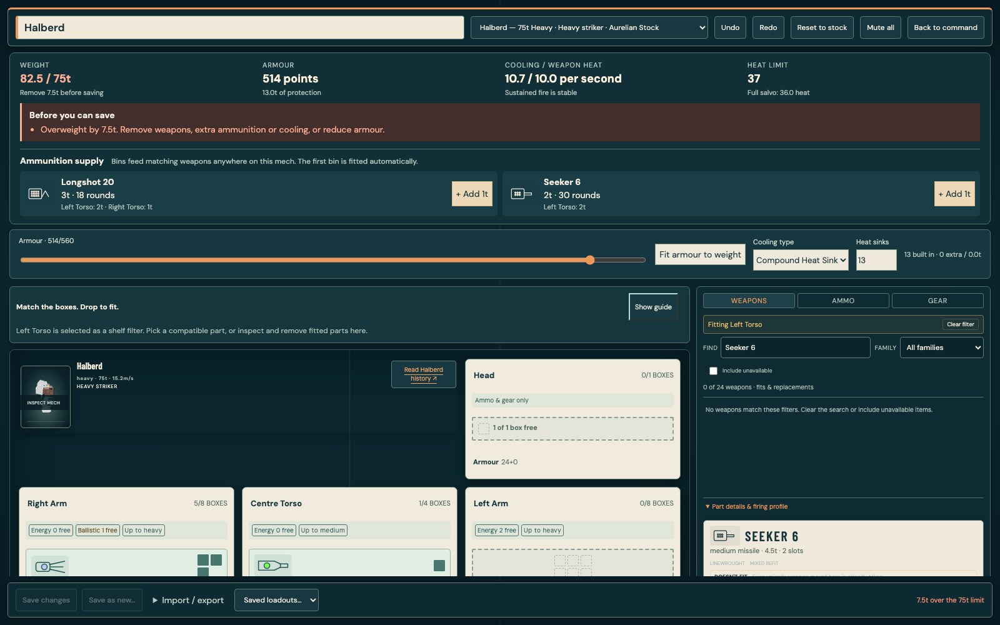
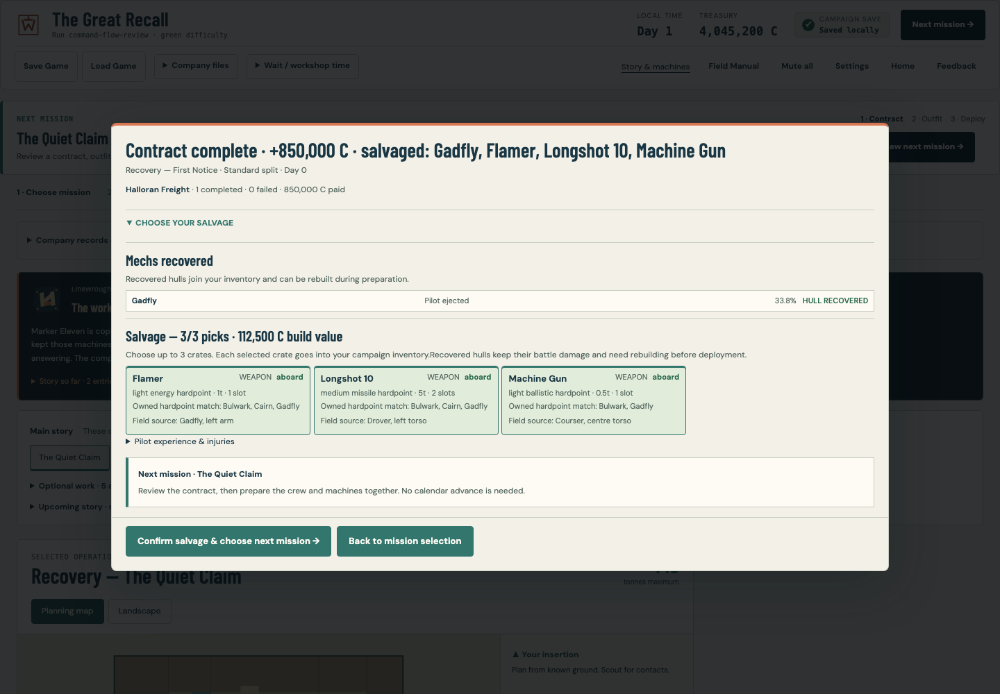
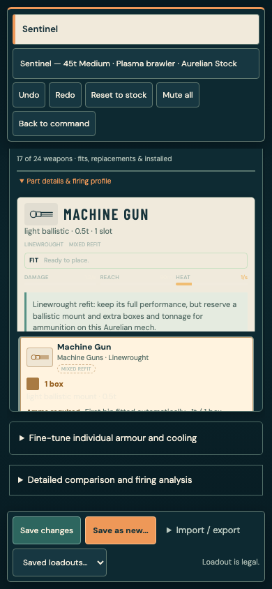

# Unified MechBay and mission preparation

## Player-facing changes

The MechBay is one editing page. Weight, armour, weapon heat, cooling and ammunition supply remain above the anatomical fitting area. Quick armour and cooling controls sit beside these limits; detailed location armour and comparison tools remain optional disclosures on the same page.

Weapons retain their illustration, name and footprint. Body compartments use larger matching boxes and explicitly identify their remaining mount families and maximum weapon size. Move and Remove occupy their own row below each weapon. Stable targeting feedback prevents those controls shifting during a pointer click. Empty legs read as mobility and armour, with no weapon rack; existing leg ammunition and equipment remain accessible for compatible legacy saves.

The ammunition list names each mounted ammunition-fed weapon, total rounds and storage location. Add 1t finds a compatible storage location; the Ammo shelf still supports manual fitting. Bins feed matching weapons across the mech. Longshot 20 and Seeker 6 have been exercised with both automatic initial bins and extra ammunition. Invalid builds show their actual blockers, including the precise excess weight and corrective choices.

The campaign's primary path is results and salvage → mission selection → repair/customise → pair pilots and deploy. Salvage selection is expanded immediately and confirmation finalizes the inventory before continuing. Choosing a mission opens preparation. Booked repairs can finish directly within preparation, with elapsed days and crew wages shown before proceeding. Existing deadline and affordability checks apply.

Company records, supplies, optional contracts, the full map and payment negotiations remain secondary disclosures. Campaign state, inventory, faction routes and simulation statistics are unchanged. Existing named loadouts and legacy campaign saves remain compatible.

## Verification

- Dedicated browser journeys cover the reported Longshot and Seeker ammunition cases, manual drag/drop, overweight correction, named save/reload, keyboard-held removal and phone layout.
- Both factions exercise results, inventory finalization, mission choice, repair charging, repair completion, refitting, pilot pairing and launch into the next briefing.
- Additional browser modules check unsaved-edit protection, multiple saved configurations, import/export, storage failure recovery, campaign rewards, pilot training, archived campaign progress, focus trapping and all authored chassis layouts.
- Screenshots inspected at desktop, laptop and phone sizes. Tests use isolated headless browsers and disposable storage; no desktop takeover or existing player save modification.
- Full regression and final build results are recorded in the completion report. No release or merge should occur with an incomplete or failing gate.

## Reproduce

Run the usual typecheck, lint, fast test suite, both builds and `node tests/e2e/playthrough.mjs`. Start a local preview on port 5223 for `node tests/e2e/unified-bay-campaign.mjs` and `node tests/e2e/unified-campaign-results.mjs`, or set `E2E_URL`. Their screenshots are written under `reports/unified-bay`.

## Visual evidence

