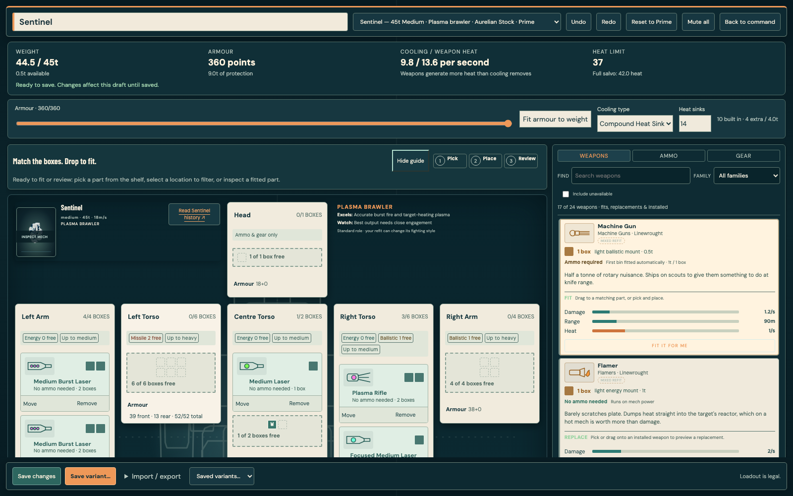
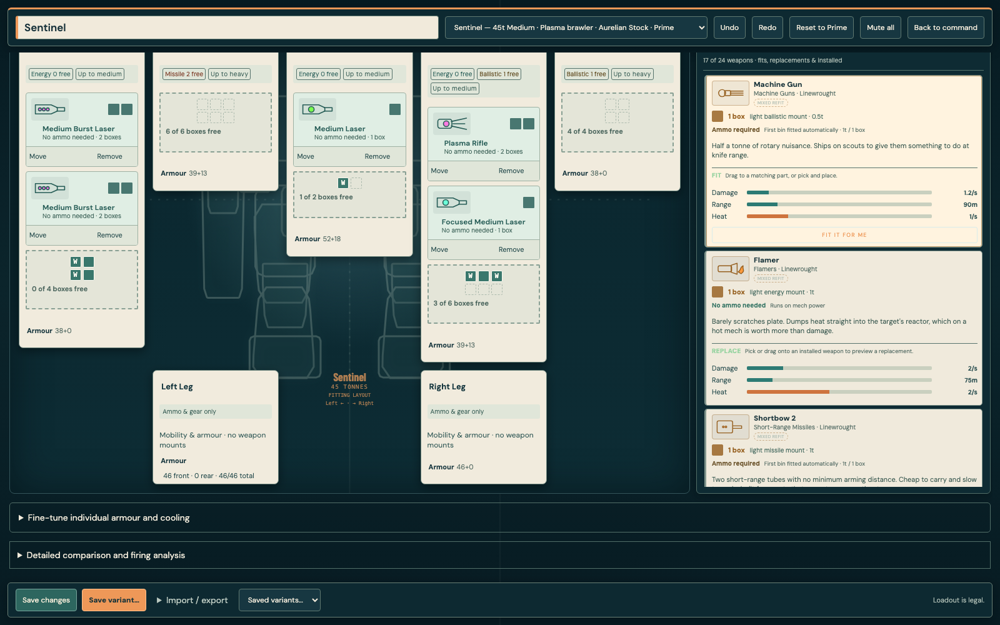
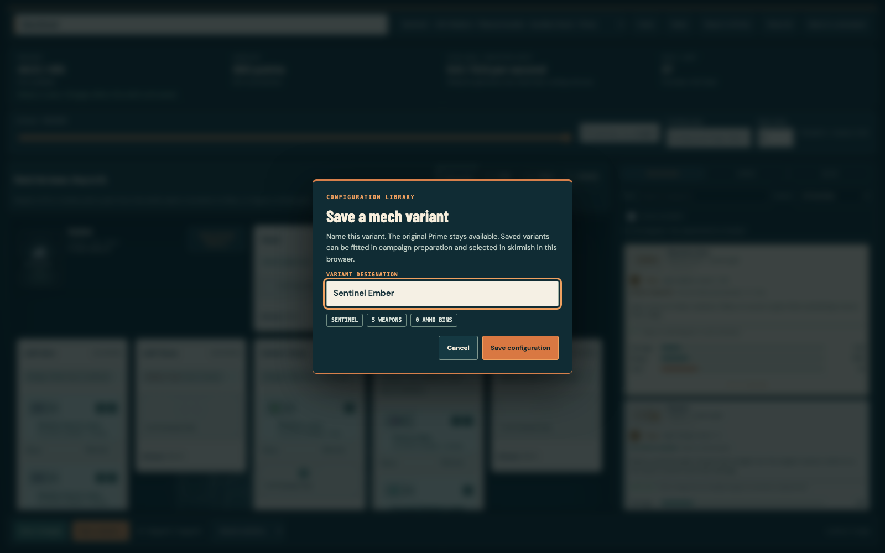
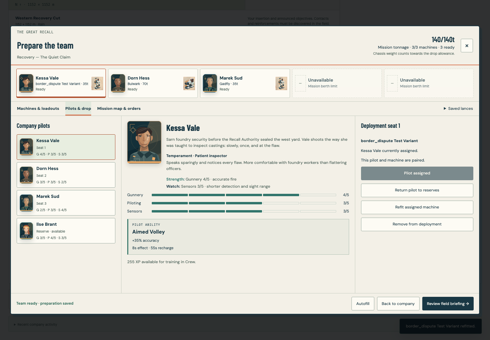

# Variants and immediate preparation

The MechBay puts the head above the centre torso, left compartments on screen left, and legs below the torso. Desktop uses five columns; narrow windows retain named left/right positions in two columns and a compact body navigator. Installed tiles preserve their weapon drawings and fitting-box footprints. Each shelf card now contains its own description and labelled damage-per-second, range and heat-per-second meters; the separate lower inspector is removed. Optional weapon-mode details stay inside the relevant card, and whole-build range analysis stays under the build review.

## Mission preparation

After results and salvage, choose the next mission and prepare a team in the existing five-seat deployment workspace. Its tonnage limit, pilot pairing and selected cockpit persist while opening the MechBay and returning. Repair and rebuild actions quote their credit cost and restore the machine immediately on payment. No waiting action, calendar deadline or daily payroll is required in the live campaign loop. Pilot injuries still cost the next mission; repairs do not heal pilots.

The old save fields remain readable. The internal `day` counter advances with completed missions for deterministic stock/progression and historical records, but players cannot spend days waiting. Existing paid workshop bookings complete when loaded without another charge. Older workshop-priority rewards are satisfied by the universal immediate workshop; supplier discounts now progress with missions. The legacy calendar helper remains for historical fixtures, not as a live player action.

## Custom variants

Factory loadouts are labelled Prime. Saving a Prime opens the designation dialog; Save variant creates another named blueprint. Campaign and skirmish refits both write to the shared variant library. Loading a campaign blueprint is restricted to the current chassis, and the existing inventory, weight, mount and credit checks still apply when committing it. A stored blueprint does not grant the campaign free equipment. Cancelling or declining an unaffordable refit retains the existing machine. Save failures are shown inside the naming dialog and keep the draft intact.

Variants are local to the browser and origin. Import/export remains available for portable backups. A commissioned refit can store a valid blueprint even when fitting it to the company machine is refused; its error explicitly distinguishes those outcomes. Campaign saves retain the deployed design independently of the shared blueprint library.

## Evidence

- All 3,490 fast tests pass, including campaign acceptance, save migration, exact-payment/insufficient-funds repair checks and pilot injury protection.
- Both faction browser journeys pass all 24 checks: settlement, salvage inventory, immediate repairs, named shared variants, exact deployment designs and skirmish reuse. These use controlled battle-result fixtures, not a claim of two manual full-campaign playthroughs.
- The 18 layout and named-save checks also verify a visible error inside the naming dialog, no partial write on storage failure, a successful retry, and a separate Field Fit designation when saving a Prime edit through Save and leave.
- Native pointer fitting checks cover moving installed weapons, illegal drops, undo, shelf placement, automatic ammunition, keyboard placement, exact save/reload and phone touch targets.
- Anatomy checks inspect every authored chassis at 1280×720; additional geometric checks cover 1600, 1280, 1024 and 390 pixel widths, centred head, left/right parts and no page overflow.
- Dedicated sensor checks verify paused activation, fog-preserving tracked red dots and probe expiry. No sensor simulation change was needed.
- Production and self-contained builds pass. The usual local preview at port 5220 was checked for named-variant save and reload without browser errors.

