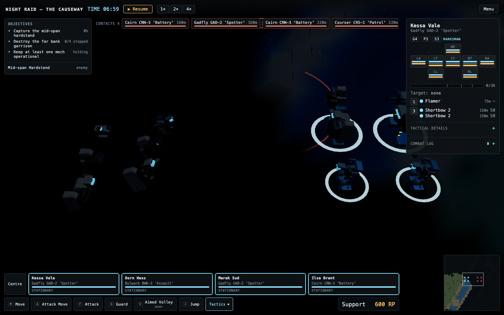
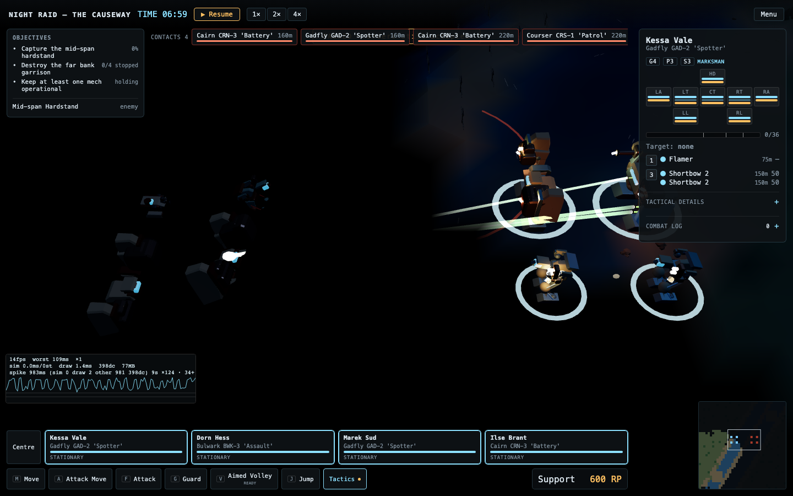
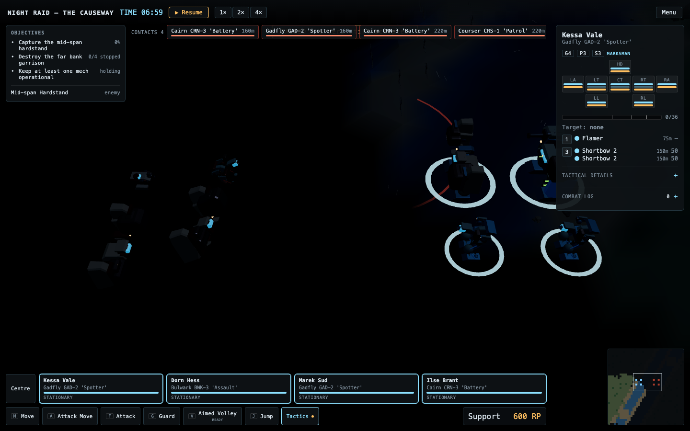
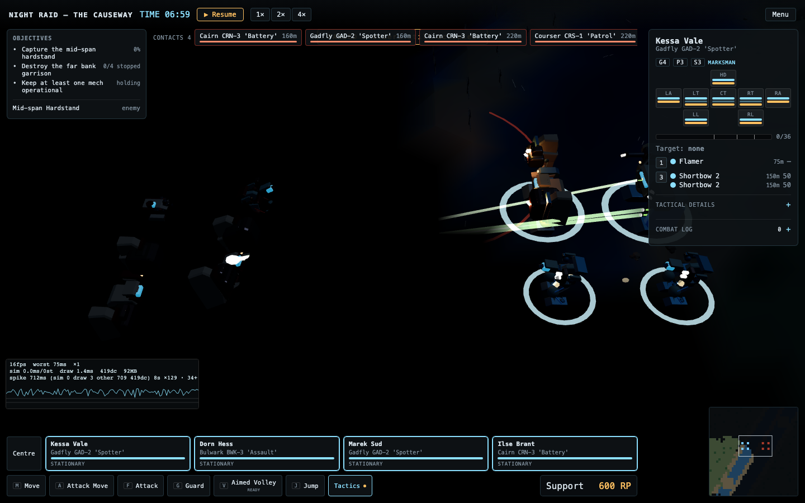
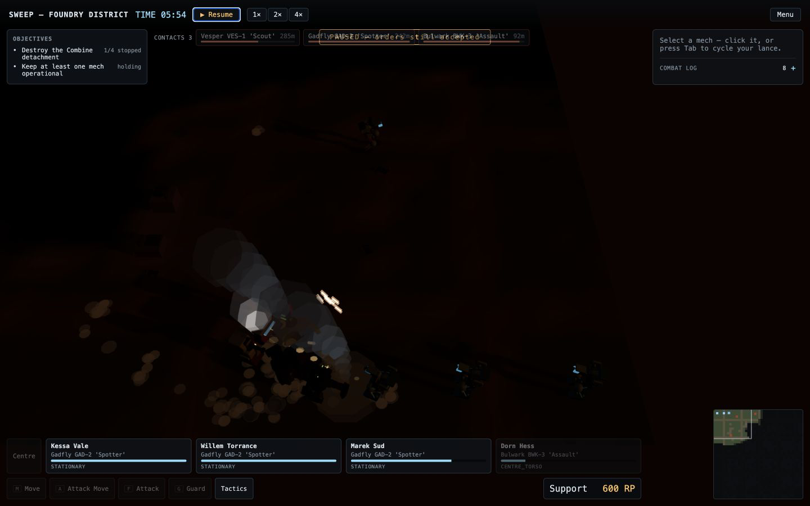

# Tier 4.1 review evidence

This branch exists only to host immutable, rendered review evidence for the
Night operations pull request. It is not a product branch and must not be
merged.

The Moonlit Night images use the same deterministic 1440 x 900 fixture before
and after the change. The Ash Dusk image is a paused 1440 x 900 capture from
`foundry_sweep` on `foundry_district`.

## Moonlit Night before

## Moonlit Night after

## Ash Dusk after

